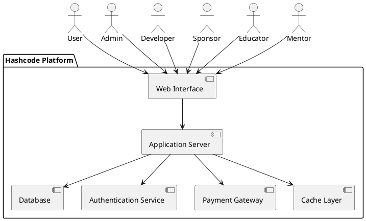
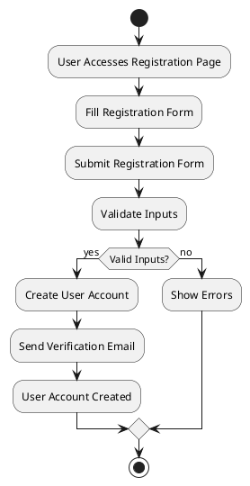
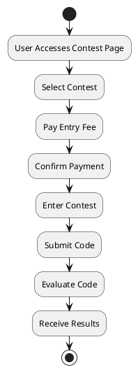

# Design Document for Hashcode

## Table of Contents
| Section | Title |
| ------- | ----- |
| 1 | Introduction |
| 2 | Design Principles |
| 3 | System Architecture |
| 4 | Detailed Design |
| 5 | Activity Diagrams |
| 6 | Expected Design |
| 7 | References |

## 1. Introduction

### 1.1 Purpose  
This Software Design Document (SDD) defines the design specifications for the HashCode Competitive Programming Platform, structured in alignment with the principles and best practices of the **Software Engineering Body of Knowledge (SWEBOK)**, the **IEEE 1016 Standard for Software Design Descriptions**, and established SDD templates. This document provides a detailed blueprint for the platform's architecture and design, ensuring compliance with industry standards and supporting efficient development and maintenance.

### 1.2 Scope  
The HashCode Competitive Programming Platform is engineered to deliver a **high-performance, scalable, and secure environment** for algorithmic problem-solving, closely mirroring the interactive experience of platforms such as Codeforces. This document outlines the core architectural components, technical design specifications, and system-level considerations to guide the platform's development lifecycle.

## 2. Design Principles
The design principles guiding this project include:
- **Modularity**: Independent modules for contests, user management, problem archives, and evaluation to ensure ease of maintenance and scalability.
- **Reusability**: Designing components that can be reused across different parts of the system.
- **Scalability**: Support for growing user bases and simultaneous contest participation through a robust backend architecture.
- **Security**: Incorporating security measures to protect user data including secure authentication and system integrity.
- **Maintainability**: Designing the system for ease of maintenance and updates.
- **Performance Optimization**: Implementing caching mechanisms, efficient algorithms, and load balancing to ensure optimal performance.

## 3. System Architecture
The system architecture consists of the following components:
- **Web Interface**: The front-end, developed using React.js with modern UI libraries for an intuitive and responsive user experience.
- **Application Server**: The back-end, developed using Node.js/Express and managing APIs.
- **Database**: A PostgreSQL database for storing structured data such as user profiles, contest details, and problem archives.
- **Authentication Service**: Handles user authentication and authorization, implementing secure login methods and token management (e.g., JWT).
- **Contest Engine**: Manages contest creation and execution.
- **Judge System**: Evaluates code submissions.

## 4. Detailed Design

### Component Design
Each component of the system is designed to fulfill specific functions:
- **Web Interface**: Provides the user interface for interacting with the platform.
- **Application Server**: Processes user requests and communicates with other services.
- **Database**: Stores user data, contest data, and transaction records with optimized indexing and normalization to ensure data consistency and quick retrieval.
- **Authentication Service**: Manages user login, registration, and session management.
- **Contest Engine**: Handles the setup, execution, and monitoring of contests.
- **Judge System**: Evaluates code submissions against predefined test cases.

### Data Design
The data design involves defining the schema for the database tables:
- **Users**: Stores user information, including login credentials and profile data.
- **Contests**: Stores contest details, including rules, participants, and results.
- **Submissions**: Stores code submissions, including user ID, contest ID, and evaluation results.

## 5. Activity Diagrams
The following activity diagrams illustrate key processes within the system:

### User Registration

### Contest Participation

## 6. Expected Design 

### Codeforces Profile

### Leetcode Profile

### Leetcode Problems

### Codeforces Contest

### Codechef Problem 

### Leetcode Problem Interface

### Codeforces Problem Interface

### Submission Interface

## 7. References
- SWEBOK: [Software Engineering Body of Knowledge](https://www.computer.org/education/bodies-of-knowledge/software-engineering/v4)
- SDD Template: [SDD Template](https://wildart.github.io/MISG5020/standards/SDD_Template.pdf)
- IEEE 1016: [IEEE Standard for Information Technology](https://standards.ieee.org/ieee/1016/4502/)

---

Documented by Team InnovateCS  
IIIT Lucknow - Software Engineering Project 2024
