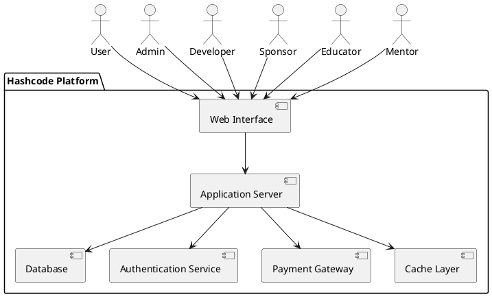
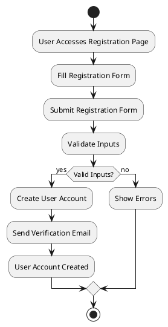
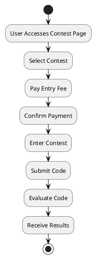

### Design Document for Hashcode

## Table of Contents
| Section | Title |
| ------- | ----- |
| 1 | Introduction |
| 2 | Design Principles |
| 3 | System Architecture |
| 4 | Detailed Design |
| 5 | Activity Diagrams |
| 6 | References |

## 1. Introduction

### 1.1 Purpose
This document provides the design specifications for the Hashcode competitive programming platform. It adheres to the principles outlined in the SWEBOK, SDD Template, and IEEE 1016 standards.

### 1.2 Scope
The HashCode Competitive Coding Platform is designed to emulate a CodeForces-like experience, offering an engaging environment for users to practice algorithmic problem-solving. This document outlines the architectural and design elements crucial for the platform’s implementation, ensuring scalability, security, and performance. It will serve as a blueprint for the development process.

## 2. Design Principles
The design principles guiding this project include:
- **Modularity**: Independent modules for contests, user management, problem archives, and evaluation to ensure ease of maintenance and scalability.
- **Reusability**: Designing components that can be reused across different parts of the system.
- **Scalability**: Support for growing user bases and simultaneous contest participation through a robust backend architecture.
- **Security**: Incorporating security measures to protect user data including secure authentication and system integrity .
- **Maintainability**: Designing the system for ease of maintenance and updates.

## 3. System Architecture
The system architecture consists of the following components:
- **Web Interface**: The front-end, developed using React.js with modern UI libraries for an intuitive and responsive user experience.
- **Application Server**: The back-end, developed using Node.js/Express and managing APIs.
- **Database**:   A PostgreSQL database for storing struc   tured data such as user profiles, contest details, and problem archives.
- **Authentication Service**: Handles user authentication and authorization.
- **Contest Engine**: Manages contest creation and execution.
- **Judge System**: Evaluates code submissions.

## 4. Detailed Design

### Component Design
Each component of the system is designed to fulfill specific functions:

- **Web Interface**: Provides the user interface for interacting with the platform.
- **Application Server**: Processes user requests and communicates with other services.
- **Database**: Stores user data, contest data, and transaction records.
- **Authentication Service**: Manages user login, registration, and session management.
- **Contest Engine**: Handles the setup, execution, and monitoring of contests.
- **Judge System**: Evaluates code submissions against predefined test cases.
- **Wallet Service**: Processes payments, manages user wallets, and handles prize distributions.

### Data Design
The data design involves defining the schema for the database tables:
- **Users**: Stores user information, including login credentials and profile data.
- **Contests**: Stores contest details, including rules, participants, and results.
- **Submissions**: Stores code submissions, including user ID, contest ID, and evaluation results.
- **Transactions**: Stores financial transactions, including user ID, amount, and transaction type.

## 5. Activity Diagrams
The following activity diagrams illustrate key processes within the system:

### User Registration

### Contest Participation

## 6. References
- SWEBOK: [Software Engineering Body of Knowledge](https://www.computer.org/education/bodies-of-knowledge/software-engineering/v4)
- SDD Template: [SDD Template](https://wildart.github.io/MISG5020/standards/SDD_Template.pdf)
- IEEE 1016: [IEEE Standard for Information Technology](https://standards.ieee.org/ieee/1016/4502/)

---

Documented by Team InnovateCS  
IIIT Lucknow - Software Engineering Project 2024
