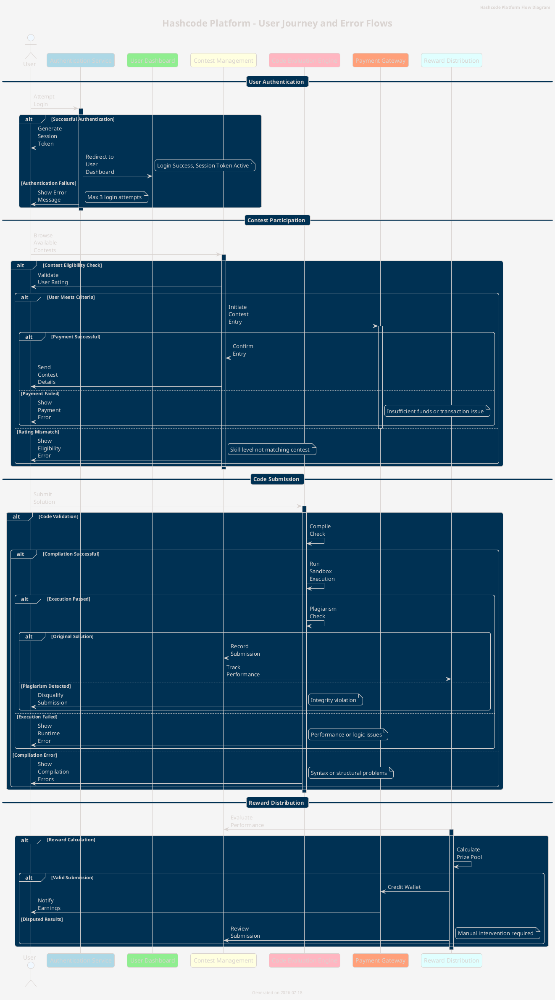

# Hashcode Platform - User Journey and Error Flows

## Overview

This document outlines the user journey and associated error flows for the Hashcode competitive programming platform. It includes processes for user authentication, contest participation, code submission, and reward distribution, ensuring clarity in user interactions and system behaviors.

---

## Flow Breakdown

### **1. User Authentication**
The authentication process ensures secure access for users.

#### **Steps**:
1. **User Action**:
   - The user attempts to log in using their credentials.
2. **System Validation**:
   - The Authentication Service verifies the credentials.

#### **Scenarios**:
- **Successful Authentication**:
  - Generates a session token and redirects the user to the dashboard.
  - _Example_: A user logs in successfully and accesses their account.
  
- **Authentication Failure**:
  - Displays an error message with a maximum of 3 login attempts allowed.
  - _Example_: Incorrect password entered three times; user account locked.

---

### **2. Contest Participation**
Users can browse and join contests based on eligibility and payment.

#### **Steps**:
1. **User Action**:
   - Browses the list of available contests.
2. **Eligibility Check**:
   - Contest Management validates the user's rating and other criteria.
3. **Payment Integration**:
   - Eligible users are prompted to pay the entry fee.

#### **Scenarios**:
- **Successful Participation**:
  - Payment is confirmed, and contest details are sent to the user.
  - _Example_: User pays the fee and receives the contest start time and rules.
  
- **Payment Failure**:
  - Displays a payment error due to insufficient funds or technical issues.
  - _Example_: User's card transaction fails; they must retry.

- **Eligibility Error**:
  - Shows an error if the user's skill level does not match the contest.
  - _Example_: A beginner tries to join an advanced-level contest.

---

### **3. Code Submission**
The core feature of the platform is evaluating user-submitted solutions.

#### **Steps**:
1. **User Action**:
   - Submits a solution for a contest problem.
2. **System Validation**:
   - The Code Evaluation Engine checks for compilation errors.
3. **Sandbox Execution**:
   - Executes the code in a secure, isolated environment.
4. **Plagiarism Detection**:
   - Ensures submission originality.

#### **Scenarios**:
- **Successful Execution**:
  - The solution passes and is recorded as a valid submission.
  - _Example_: User's solution produces correct results for all test cases.
  
- **Compilation Error**:
  - Displays syntax or structural issues in the user's code.
  - _Example_: A missing semicolon in C++ prevents compilation.
  
- **Runtime Error**:
  - Indicates performance or logic issues during execution.
  - _Example_: Infinite loop causing timeout.
  
- **Plagiarism Detected**:
  - Disqualifies the submission due to integrity violations.
  - _Example_: Identical code found between multiple submissions.

---

### **4. Reward Distribution**
Rewards are calculated and distributed based on performance.

#### **Steps**:
1. **Performance Evaluation**:
   - Reward Distribution evaluates contest results.
2. **Prize Calculation**:
   - Determines the prize pool and distributes rewards.

#### **Scenarios**:
- **Successful Reward Distribution**:
  - Credits the user's wallet and sends a notification.
  - _Example_: User wins first place and receives prize money.
  
- **Disputed Results**:
  - Requires manual review of the submission.
  - _Example_: Suspicion of unfair play prompts investigation.

---

## PUML Code

Below is the PlantUML code representing the flow:

---

## Conclusion

This document provides a detailed view of the user journey and error flows for the Hashcode platform. It ensures a comprehensive understanding of platform functionalities and edge cases, facilitating better development and user experience.
