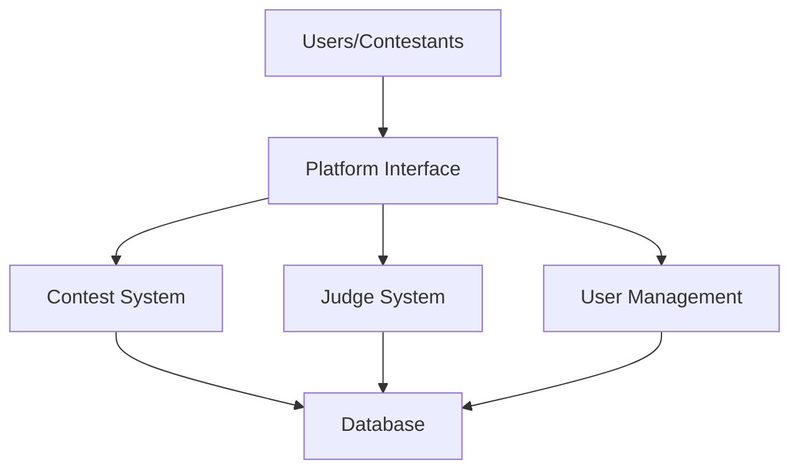
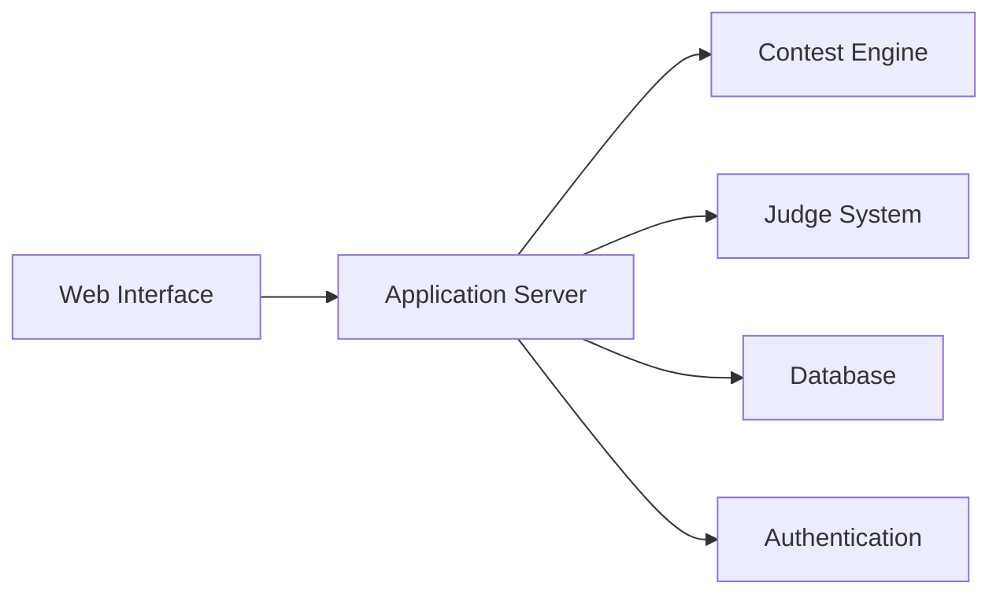
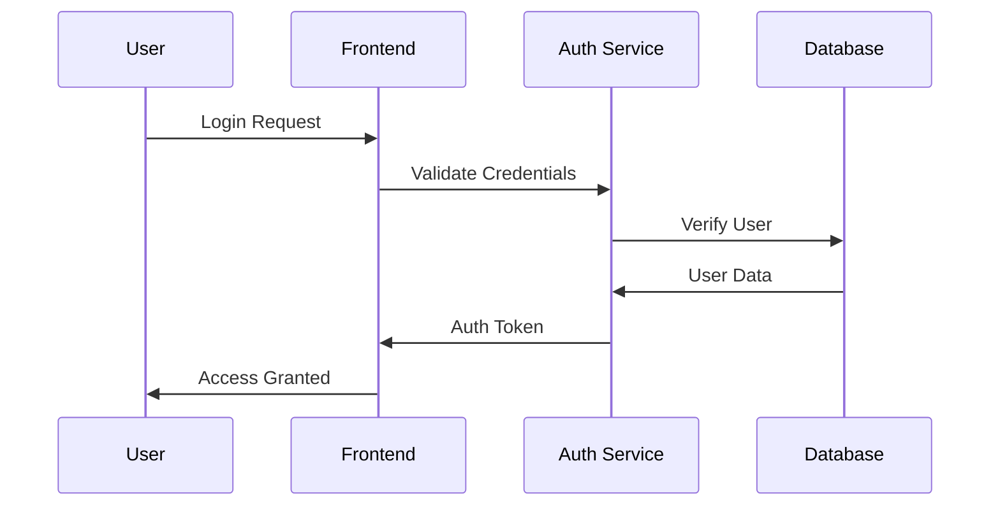
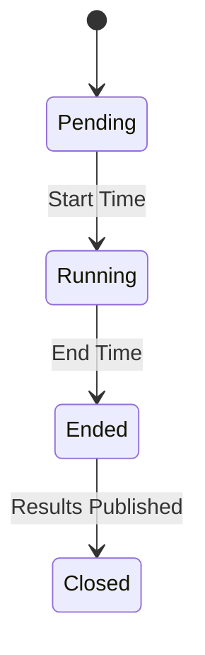
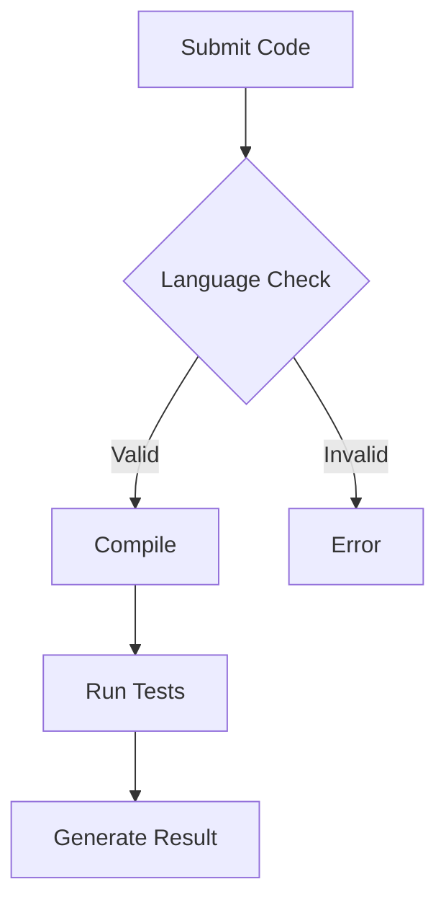

# Software Requirements Specification (SRS)
## Hashcode v1.0

## Table of Contents
1. [Introduction](#1-introduction)
2. [System Overview](#2-system-overview)
3. [Functional Requirements](#3-functional-requirements)
4. [Use Cases](#4-use-cases)
5. [Non-Functional Requirements](#5-non-functional-requirements)
6. [System Constraints](#6-system-constraints)
7. [Appendix](#7-appendix)

## 1. Introduction

### 1.1 Purpose
Hashcode aims to revolutionize competitive programming by providing a robust, scalable, and user-friendly environment for programmers to enhance their algorithmic problem-solving skills. This document outlines the comprehensive requirements for building this platform.

### 1.2 Project Scope
The platform will serve as a complete ecosystem for:
- Conducting real-time programming contests
- Automated code evaluation
- Performance tracking and ranking
- Community interaction and learning
- Contest management and administration

### 1.3 System Context

## 2. System Overview

### 2.1 Core Components

### 2.2 Key Features

1. **Contest Management System**
   - Real-time contest hosting
   - Multiple contest formats
   - Automated scheduling
   - Result compilation
   - Editorial management

2. **User Management System**
   - Profile management
   - Rating system
   - Progress tracking
   - Achievement system
   - Social features

3. **Problem Management**
   - Problem bank
   - Test case management
   - Difficulty classification
   - Topic categorization
   - Solution verification

## 3. Functional Requirements

### 3.1 User Authentication & Authorization

#### Detailed Requirements:
1. **Registration Process**
   - Email verification required
   - Username must be unique
   - Password requirements:
     - Minimum 8 characters
     - At least 1 uppercase letter
     - At least 1 number
     - At least 1 special character
   - OAuth support for Google and GitHub

2. **Authentication Features**
   - JWT-based authentication
   - Session management
   - Password reset functionality
   - 2FA support (optional)
   - Remember me functionality

### 3.2 Contest System

#### Contest States

#### Contest Requirements:
1. **Contest Creation**
   - Title and description
   - Start and end time
   - Problem set selection
   - Scoring rules
   - Visibility settings (public/private)

2. **During Contest**
   - Real-time scoreboard
   - Announcement system
   - Problem statement access
   - Code submission
   - Clarification requests

3. **Post Contest**
   - Final rankings
   - Editorial access
   - Solution viewing
   - Rating updates
   - Certificate generation

### 3.3 Code Evaluation System

#### Evaluation Process:
1. **Submission Handling**
   - Support for multiple languages
   - Code size limitations
   - Syntax verification
   - Plagiarism check

2. **Testing Process**
   - Compile time limit: 10 seconds
   - Runtime limit: 2 seconds per test case
   - Memory limit: 256MB
   - Output size limit: 64MB

## 4. Use Cases

### Use Case 1: Competitive Programmers

| Use Case ID | UC-01 |
|-------------|-------|
| Name | User Registration |
| Actors | User, System |
| Description | A user registers an account by providing an email, username, and password. |
| Preconditions | User has access to the registration page. |
| Postconditions | User account is created and verification email is sent. |
| Main Flow | 1. User navigates to registration page.  2. User fills in email, username, and password.  3. System validates inputs.  4. System creates user account.  5. System sends verification email. |
| Alternative Flows | A1: Email already in use.  A2: Invalid input data. |

### Use Case 2: Administrators

| Use Case ID | UC-02 |
|-------------|-------|
| Name | Contest Creation |
| Actors | Administrator, System |
| Description | An administrator creates a new contest by setting up its details and adding problems. |
| Preconditions | Administrator is logged in and has access to the contest creation interface. |
| Postconditions | New contest is created and available for users to join. |
| Main Flow | 1. Administrator navigates to contest creation page.  2. Administrator enters contest details.  3. Administrator selects problems for the contest.  4. System validates and saves the contest details.  5. Contest is published and visible to users. |
| Alternative Flows | A1: Invalid contest details.  A2: Problems not found. |

### Use Case 3: Developers

| Use Case ID | UC-03 |
|-------------|-------|
| Name | Code Deployment |
| Actors | Developer, System |
| Description | A developer deploys new code updates to the platform. |
| Preconditions | Developer has access to the code repository and deployment tools. |
| Postconditions | New code is deployed and platform is updated. |
| Main Flow | 1. Developer commits code changes to repository.  2. Developer initiates deployment process.  3. System builds and tests the new code.  4. System deploys the new code to production.  5. Platform is updated with new features or fixes. |
| Alternative Flows | A1: Build fails.  A2: Tests fail. |

### Use Case 4: Sponsors and Organizations

| Use Case ID | UC-04 |
|-------------|-------|
| Name | Sponsor Contest |
| Actors | Sponsor, System |
| Description | A sponsor sets up a sponsored contest with custom branding and settings. |
| Preconditions | Sponsor is registered and logged in. |
| Postconditions | Sponsored contest is created and promoted on the platform. |
| Main Flow | 1. Sponsor navigates to contest sponsorship page.  2. Sponsor enters contest details and custom branding.  3. Sponsor sets contest rules and prizes.  4. System validates and saves the contest details.  5. Sponsored contest is published and promoted. |
| Alternative Flows | A1: Invalid contest details.  A2: Branding assets not uploaded. |

### Use Case 5: Educational Institutions

| Use Case ID | UC-05 |
|-------------|-------|
| Name | Bulk Student Registration |
| Actors | Educator, System |
| Description | An educator registers multiple students for a private contest. |
| Preconditions | Educator is registered and logged in. |
| Postconditions | Students are registered and added to the private contest. |
| Main Flow | 1. Educator navigates to bulk registration page.  2. Educator uploads student details file.  3. System validates and registers students.  4. System adds students to the private contest.  5. Confirmation is sent to educator. |
| Alternative Flows | A1: Invalid student details file.  A2: Students already registered. |

### Use Case 6: Mentors and Coaches

| Use Case ID | UC-06 |
|-------------|-------|
| Name | Track Student Progress |
| Actors | Mentor, System |
| Description | A mentor tracks the progress of their students over time. |
| Preconditions | Mentor is registered and logged in. Students are registered and assigned to the mentor. |
| Postconditions | Mentor views detailed progress reports for students. |
| Main Flow | 1. Mentor navigates to student progress page.  2. Mentor selects student or group of students.  3. System displays detailed progress reports.  4. Mentor reviews and provides feedback. |
| Alternative Flows | A1: No student data available.  A2: Invalid student selection. |

### Use Case 7: System Administrators

| Use Case ID | UC-07 |
|-------------|-------|
| Name | Monitor System Health |
| Actors | System Administrator, System |
| Description | A system administrator monitors the health and performance of the platform. |
| Preconditions | System administrator has access to monitoring tools. |
| Postconditions | System health and performance metrics are displayed. |
| Main Flow | 1. System administrator navigates to monitoring dashboard.  2. System administrator views real-time metrics.  3. System administrator sets up alerts for potential issues.  4. System displays alerts and logs.  5. System administrator takes corrective actions if needed. |
| Alternative Flows | A1: Monitoring tools unavailable.  A2: Invalid metrics display. |

### Use Case 8: Event Organizers

| Use Case ID | UC-08 |
|-------------|-------|
| Name | Host Large-Scale Event |
| Actors | Event Organizer, System |
| Description | An event organizer hosts a large-scale competitive programming event. |
| Preconditions | Event organizer is registered and logged in. |
| Postconditions | Large-scale event is set up and managed on the platform. |
| Main Flow | 1. Event organizer navigates to event setup page.  2. Event organizer enters event details and custom settings.  3. System validates and saves event details.  4. System scales resources for large event.  5. Event is hosted and monitored for performance. |
| Alternative Flows | A1: Invalid event details.  A2: Resource scaling issues. |

### Use Case 9: Open Source Contributors

| Use Case ID | UC-09 |
|-------------|-------|
| Name | Contribute to Codebase |
| Actors | Contributor, System |
| Description | An open source contributor submits code changes to the platform. |
| Preconditions | Contributor has access to the code repository. |
| Postconditions | Code changes are reviewed and merged into the main codebase. |
| Main Flow | 1. Contributor forks the repository and makes code changes.  2. Contributor submits pull request.  3. System runs automated tests on pull request.  4. Maintainers review and approve pull request.  5. Code changes are merged into the main codebase. |
| Alternative Flows | A1: Tests fail.  A2: Pull request rejected. |

### Use Case 10: General Public

| Use Case ID | UC-10 |
|-------------|-------|
| Name | Access Learning Resources |
| Actors | Casual User, System |
| Description | A casual user accesses tutorials and learning resources on the platform. |
| Preconditions | User has access to the platform. |
| Postconditions | User views and utilizes learning resources. |
| Main Flow | 1. User navigates to learning resources page.  2. User selects a tutorial or guide.  3. System displays the selected resource.  4. User follows the tutorial or guide. |
| Alternative Flows | A1: Resource not found.  A2: Invalid resource selection. |

## 5. Non-Functional Requirements

### 5.1 Performance Requirements

| Metric | Normal Load | Peak Load |
|--------|-------------|-----------|
| Page Load Time | < 2 seconds | < 4 seconds |
| API Response Time | < 500ms | < 1 second |
| Concurrent Users | 5,000 | 10,000 |
| Database Queries | 1000/second | 2000/second |

### 5.2 Security Requirements

1. **Data Protection**
   - HTTPS encryption
   - SQL injection prevention
   - XSS protection
   - CSRF protection
   - Rate limiting

2. **System Security**
   - Regular security audits
   - Automated vulnerability scanning
   - Secure password storage (bcrypt)
   - Session management
   - Access control lists

### 5.3 Reliability Requirements

1. **Availability**
   - 99.9% uptime guarantee
   - Automated backups
   - Disaster recovery plan
   - Failover mechanisms

2. **Error Handling**
   - Graceful degradation
   - User-friendly error messages
   - Error logging and monitoring
   - Automated error reporting

### 5.4 Usability Requirements

1. **User Interface**
   - Intuitive and user-friendly design
   - Consistent navigation and layout
   - Accessibility features (e.g., screen reader support)

2. **Documentation**
   - Comprehensive user manuals
   - In-platform help and tooltips
   - Tutorial videos and guides

### 5.5 Scalability Requirements

1. **System Scalability**
   - Support for increasing number of users and data
   - Horizontal and vertical scaling capabilities

2. **Performance Under Load**
   - Load testing to ensure performance during peak times
   - Efficient resource management

## 6. System Constraints

### 6.1 Technical Constraints
1. **Infrastructure**
   - Cloud-based deployment (AWS/GCP)
   - Container orchestration (Kubernetes)
   - CI/CD pipeline requirements
   - Monitoring systems

2. **Development**
   - Backend: Node.js/Express
   - Frontend: React.js
   - Database: PostgreSQL
   - Cache: Redis
   - Message Queue: RabbitMQ

### 6.2 Business Constraints
1. **Timeline**
   - MVP: 4 months
   - Beta testing: 2 months
   - Full release: 6 months

2. **Resource Constraints**
   - Development team: 6 members
   - Infrastructure budget: $X/month
   - Third-party service limitations

## 7. Appendix

### 7.1 Terminology

| Term | Definition |
|------|------------|
| Contest | Time-bound programming competition |
| Submission | Solution submitted by a user |
| Verdict | Result of code evaluation |
| Rating | User's performance metric |
| Editorial | Official solution explanation |

### 7.2 References
1. IEEE 830-1998 SRS Guidelines
2. SWEBOK v4.0 Requirements Analysis
3. ISO/IEC/IEEE 29148:2018
4. [Codeforces Platform](https://codeforces.com)
5. [ICPC Competition Rules](https://icpc.global)

---

*Documented by Team InnovateCS*  
IIIT Lucknow - Software Engineering Project 2024

