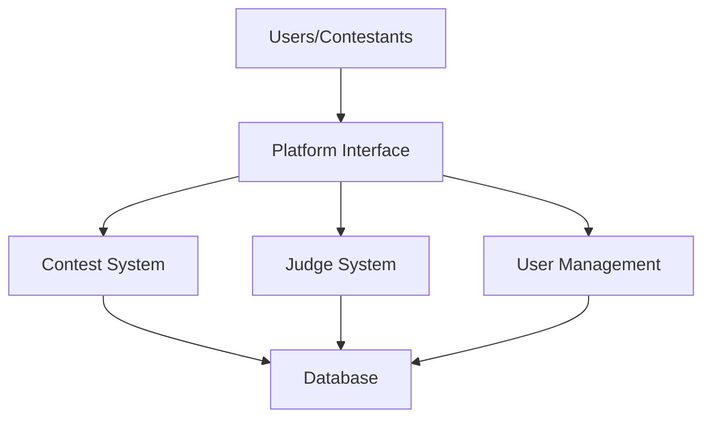
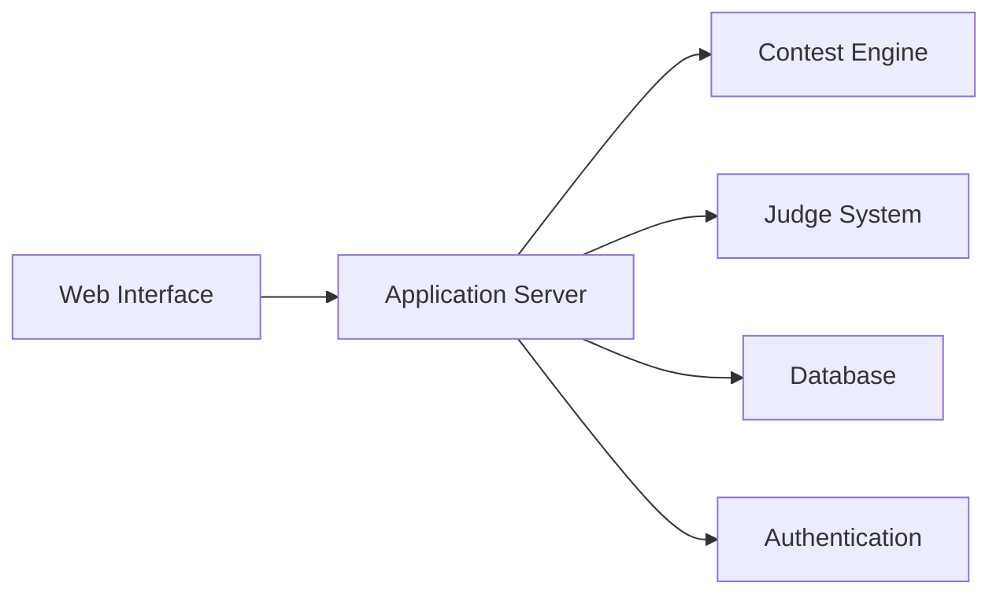
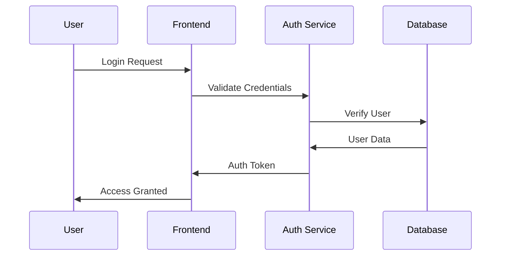
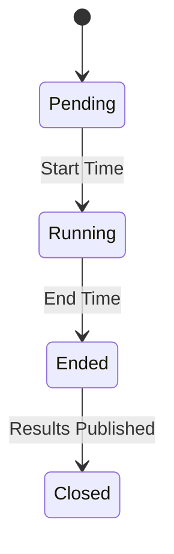
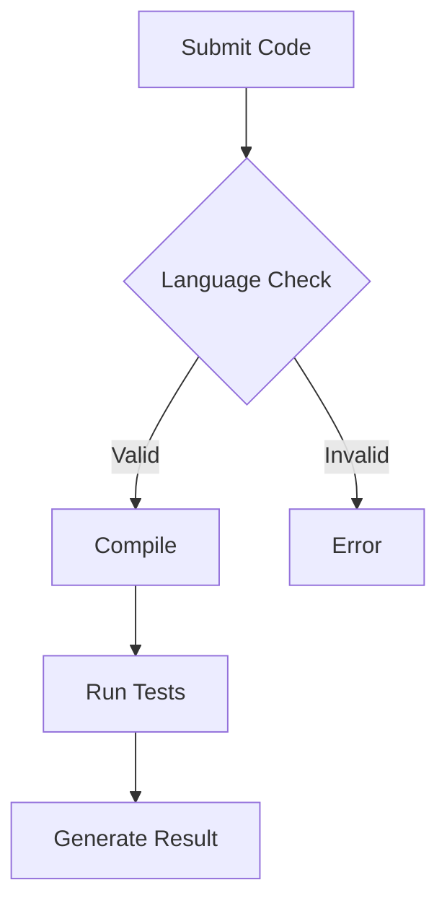

# Software Requirements Specification (SRS)
## CodeForces Arena Platform v1.0

## Table of Contents
1. [Introduction](#1-introduction)
2. [System Overview](#2-system-overview)
3. [Functional Requirements](#3-functional-requirements)
4. [Non-Functional Requirements](#4-non-functional-requirements)
5. [System Constraints](#5-system-constraints)
6. [Appendix](#6-appendix)

## 1. Introduction

### 1.1 Purpose
The CodeForces Arena platform aims to revolutionize competitive programming by providing a robust, scalable, and user-friendly environment for programmers to enhance their algorithmic problem-solving skills. This document outlines the comprehensive requirements for building this platform.

### 1.2 Project Scope
The platform will serve as a complete ecosystem for:
- Conducting real-time programming contests
- Automated code evaluation
- Performance tracking and ranking
- Community interaction and learning
- Contest management and administration

### 1.3 System Context

## 2. System Overview

### 2.1 Core Components

### 2.2 Key Features

1. **Contest Management System**
   - Real-time contest hosting
   - Multiple contest formats
   - Automated scheduling
   - Result compilation
   - Editorial management

2. **User Management System**
   - Profile management
   - Rating system
   - Progress tracking
   - Achievement system
   - Social features

3. **Problem Management**
   - Problem bank
   - Test case management
   - Difficulty classification
   - Topic categorization
   - Solution verification

## 3. Functional Requirements

### 3.1 User Authentication & Authorization

#### Detailed Requirements:
1. **Registration Process**
   - Email verification required
   - Username must be unique
   - Password requirements:
     - Minimum 8 characters
     - At least 1 uppercase letter
     - At least 1 number
     - At least 1 special character
   - OAuth support for Google and GitHub

2. **Authentication Features**
   - JWT-based authentication
   - Session management
   - Password reset functionality
   - 2FA support (optional)
   - Remember me functionality

### 3.2 Contest System

#### Contest States

#### Contest Requirements:
1. **Contest Creation**
   - Title and description
   - Start and end time
   - Problem set selection
   - Scoring rules
   - Visibility settings (public/private)

2. **During Contest**
   - Real-time scoreboard
   - Announcement system
   - Problem statement access
   - Code submission
   - Clarification requests

3. **Post Contest**
   - Final rankings
   - Editorial access
   - Solution viewing
   - Rating updates
   - Certificate generation

### 3.3 Code Evaluation System

#### Evaluation Process:
1. **Submission Handling**
   - Support for multiple languages
   - Code size limitations
   - Syntax verification
   - Plagiarism check

2. **Testing Process**
   - Compile time limit: 10 seconds
   - Runtime limit: 2 seconds per test case
   - Memory limit: 256MB
   - Output size limit: 64MB

## 4. Non-Functional Requirements

### 4.1 Performance Requirements

| Metric | Normal Load | Peak Load |
|--------|-------------|-----------|
| Page Load Time | < 2 seconds | < 4 seconds |
| API Response Time | < 500ms | < 1 second |
| Concurrent Users | 5,000 | 10,000 |
| Database Queries | 1000/second | 2000/second |

### 4.2 Security Requirements

1. **Data Protection**
   - HTTPS encryption
   - SQL injection prevention
   - XSS protection
   - CSRF protection
   - Rate limiting

2. **System Security**
   - Regular security audits
   - Automated vulnerability scanning
   - Secure password storage (bcrypt)
   - Session management
   - Access control lists

### 4.3 Reliability Requirements

1. **Availability**
   - 99.9% uptime guarantee
   - Automated backups
   - Disaster recovery plan
   - Failover mechanisms

2. **Error Handling**
   - Graceful degradation
   - User-friendly error messages
   - Error logging and monitoring
   - Automated error reporting

## 5. System Constraints

### 5.1 Technical Constraints
1. **Infrastructure**
   - Cloud-based deployment (AWS/GCP)
   - Container orchestration (Kubernetes)
   - CI/CD pipeline requirements
   - Monitoring systems

2. **Development**
   - Backend: Node.js/Express
   - Frontend: React.js
   - Database: PostgreSQL
   - Cache: Redis
   - Message Queue: RabbitMQ

### 5.2 Business Constraints
1. **Timeline**
   - MVP: 4 months
   - Beta testing: 2 months
   - Full release: 6 months

2. **Resource Constraints**
   - Development team: 6 members
   - Infrastructure budget: $X/month
   - Third-party service limitations

## 6. Appendix

### 6.1 Terminology

| Term | Definition |
|------|------------|
| Contest | Time-bound programming competition |
| Submission | Solution submitted by a user |
| Verdict | Result of code evaluation |
| Rating | User's performance metric |
| Editorial | Official solution explanation |

### 6.2 References
1. IEEE 830-1998 SRS Guidelines
2. SWEBOK v4.0 Requirements Analysis
3. ISO/IEC/IEEE 29148:2018
4. [Codeforces Platform](https://codeforces.com)
5. [ICPC Competition Rules](https://icpc.global)

---

*Documented by Team InnovateCS*  
IIIT Lucknow - Software Engineering Project 2024

