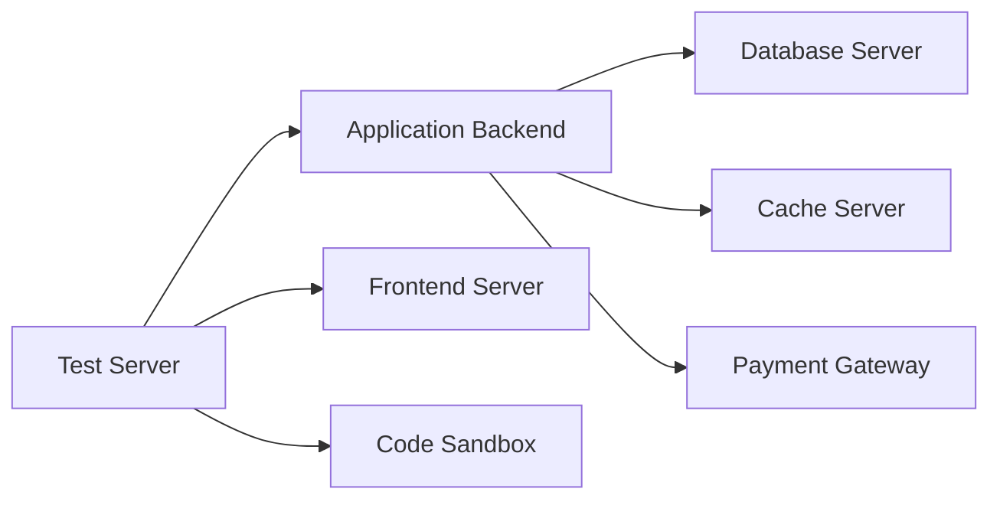
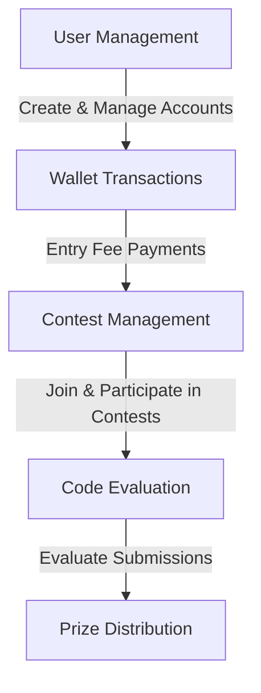
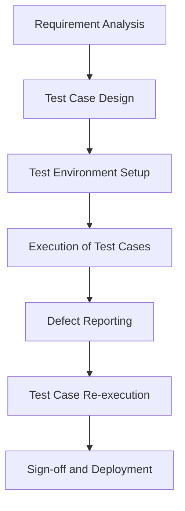
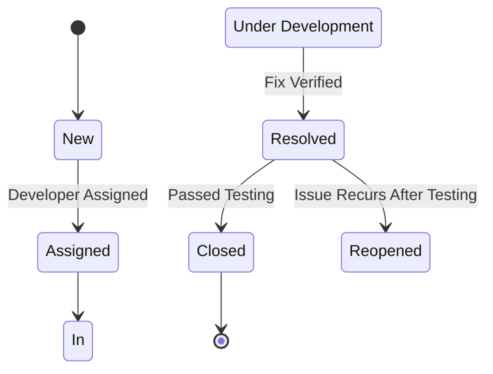

# Software Test Documentation
## Hashcode: A Modern Competitive Programming Platform
**Ensuring a Robust and Scalable Platform through Comprehensive Testing**  

## Table of Contents
| Section | Title |
| ------- | ----- |
| 1 | Test Plan |
| 2 | Test Design Specification |
| 3 | Test Case Specification |
| 4 | Test Procedure Specification |
| 5 | Test Scenarios |
| 6 | Test Summary Report |

---

## **1. Test Plan**  

### **1.1 Introduction**  
The purpose of this document is to outline the testing strategy, methodology, and test cases for the **Hashcode Online Competitive Programming Platform**, ensuring robust quality standards. This document aims to cover all aspects of testing to ensure a reliable, secure, and user-friendly platform.

---

### **1.2 Test Items**  
- User Management  
- Contest Management  
- Code Evaluation  
- Payment Processing  

---

### **1.3 Features to be Tested**  
- **User Management System**: Registration, login, and profile features.  
- **Contest Management**: Contest creation, participation, and rankings.  
- **Code Evaluation**: Submission, execution, and scoring.  
- **Payment Processing**: Wallet transactions, entry fee payments, and prize distribution.  

---

### **1.4 Features Not to Be Tested**  
- Real-time chat functionality.  
- Offline mode or mobile applications (deferred to future phases).  

---

### **1.5 Testing Approach**  
The testing process includes:  
1. **Unit Testing**: Validating individual modules.  
2. **Integration Testing**: Ensuring proper interactions between components.  
3. **System Testing**: Testing the end-to-end functionality.  
4. **Acceptance Testing**: Validating against user requirements.  
5. **Performance Testing**: Ensuring scalability and responsiveness under load.  
6. **Security Testing**: Verifying the platform's security measures.  
7. **Usability Testing**: Ensuring the platform is user-friendly and accessible.  
8. **Reliability Testing**: Verifying system uptime and error handling.

**Testing Style**: Behavior-Driven Development (BDD) using **Cucumber** for Gherkin-style test scenarios and **Chai** for assertions.  

---

### **1.6 Pass/Fail Criteria**  
A test case is marked as **Pass** if actual outcomes match expected results. A test case is marked as **Fail** if there are deviations, performance issues, or errors.

---

### **1.7 Suspension and Resumption Criteria**  
- Testing will be **suspended** in the event of critical failures (e.g., server crashes, significant defects).  
- Testing will **resume** after defect resolution and retesting of the impacted areas. 

### **1.8 Test Environment**

| Component             | Details                              |  
|-----------------------|--------------------------------------|  
| **Client Systems**    | Chrome (v114+), Firefox (v98+), Edge |  
| **Server Environment**| AWS (EC2, RDS, S3)                  |  
| **Databases**         | PostgreSQL (v13+)                   |  
| **Code Sandbox**      | Secure, isolated execution environment |  
| **Testing Tools**     | Selenium, Postman, JMeter           |  

Environment Configuration



- Database : Preloaded with test data for user accounts, contests, and problems.
- Code Sandbox : Configured for secure and isolated code execution.
- Payment Gateway : Mock setup to simulate transactions without real-world implications.
---

## **2. Test Design Specification**  

### **2.1 Test Design Overview** 
This design ensures compliance with functional, performance, and security requirements, targeting critical modules such as contest rankings and payment processing.  

---

### **2.2 Test Features Overview**  
- **User Management**: Secure registration, login, and wallet features.  
- **Contest System**: Transparent contest participation and result accuracy.  
- **Code Evaluation**: Secure and precise execution in a sandboxed environment.  
- **Payment Processing**: Safe wallet transactions and prize distributions.  


---

## 3. Test Case Specification

### 3.1 User Registration
```gherkin
Feature: User Registration

  Scenario: Successful user registration
    Given a new user is on the registration page
    When the user enters valid registration details
    And the user submits the registration form
    Then the user account should be created
    And a verification email should be sent
```

```javascript
const chai = require('chai');
const expect = chai.expect;

describe('User Registration', () => {
  it('should create a user account and send a verification email', () => {
    const registrationDetails = {
      email: 'user@example.com',
      username: 'newuser',
      password: 'Password123!'
    };
    const result = registerUser(registrationDetails);
    expect(result).to.have.property('success', true);
    expect(result).to.have.property('verificationEmailSent', true);
  });
});
```

### 3.2 Contest Participation
```gherkin
Feature: Contest Participation

  Scenario: Successful contest participation
    Given a registered user is on the contest page
    When the user selects a contest
    And the user pays the entry fee
    Then the user should be enrolled in the contest
    And the contest should be accessible to the user
```

```javascript
describe('Contest Participation', () => {
  it('should enroll the user in the contest and make it accessible', () => {
    const userId = 'user123';
    const contestId = 'contest456';
    const result = enrollInContest(userId, contestId);
    expect(result).to.have.property('enrolled', true);
    expect(result).to.have.property('accessGranted', true);
  });
});
```

### 3.3 Code Evaluation
```gherkin
Feature: Code Evaluation

  Scenario: Successful code submission and evaluation
    Given a user is participating in a contest
    When the user submits a valid code solution
    Then the code should be executed in a sandboxed environment
    And the results should be displayed to the user
```

```javascript
describe('Code Evaluation', () => {
  it('should execute the code in a sandboxed environment and display results', () => {
    const codeSubmission = {
      userId: 'user123',
      contestId: 'contest456',
      code: 'print("Hello, World!")',
      language: 'python'
    };
    const result = evaluateCode(codeSubmission);
    expect(result).to.have.property('executed', true);
    expect(result).to.have.property('resultsDisplayed', true);
  });
});
```

### 3.4 Payment Processing
```gherkin
Feature: Payment Processing

  Scenario: Successful wallet transaction
    Given a user has sufficient funds in their wallet
    When the user initiates a transaction
    Then the transaction should be processed
    And the wallet balance should be updated
```

```javascript
describe('Payment Processing', () => {
  it('should process the transaction and update the wallet balance', () => {
    const transactionDetails = {
      userId: 'user123',
      amount: 10,
      currency: 'USD'
    };
    const result = processTransaction(transactionDetails);
    expect(result).to.have.property('processed', true);
    expect(result.walletBalance).to.be.a('number');
  });
});
```

### 3.5 User Management System

```gherkin
Feature: User Management System

  Scenario: Register with valid and invalid credentials
    Given a new user is on the registration page
    When the user enters valid registration details
    Then the user account should be created
    And a verification email should be sent

  Scenario: Authenticate using Google and GitHub OAuth
    Given a user is on the login page
    When the user selects Google OAuth
    Then the user should be logged in through Google

    Given a user is on the login page
    When the user selects GitHub OAuth
    Then the user should be logged in through GitHub

  Scenario: Add funds to wallet and view transaction history
    Given a user is on the wallet page
    When the user adds funds to the wallet
    Then the wallet balance should be updated
    And the transaction should be recorded in the transaction history
```

### 3.6 Contest Participation

```gherkin
Feature: Contest Participation

  Scenario: Pay entry fees and join contests
    Given a registered user is on the contest page
    When the user selects a contest and pays the entry fee
    Then the user should be enrolled in the contest

  Scenario: Submit solutions during active contests
    Given a user is participating in a contest
    When the user submits a code solution
    Then the solution should be evaluated and ranked

  Scenario: Receive prizes and view prize distribution details
    Given a user has won a contest
    When the contest ends
    Then the prize should be distributed
    And the user should be able to view the prize distribution details
```

### 3.7 Problem Archive

```gherkin
Feature: Problem Archive

  Scenario: Access problems by difficulty or topic
    Given a user is on the problem archive page
    When the user filters problems by difficulty or topic
    Then the problems should be listed correctly

  Scenario: View editorial and hints after solving
    Given a user has solved a problem
    When the user views the problem details
    Then the editorial and hints should be available
```

### 3.8 Community Features

```gherkin
Feature: Community Features

  Scenario: Post on discussion forums and interact with other users
    Given a user is on the discussion forum page
    When the user creates a new post
    Then the post should appear correctly
    And other users should be able to reply

  Scenario: Upload solutions to the marketplace
    Given a user has solved a problem
    When the user uploads the solution to the marketplace
    Then the solution should be listed with appropriate monetization options
```

---

## 4. Test Procedure Specification

### 4.1 User Registration Procedure
1. Navigate to the registration page.
2. Enter valid registration details.
3. Submit the registration form.
4. Verify the user account creation and email verification.

### 4.2 Contest Participation Procedure
1. Navigate to the contest page.
2. Select a contest.
3. Pay the entry fee.
4. Verify contest enrollment and accessibility.

### 4.3 Code Evaluation Procedure
1. Submit a code solution during an active contest.  
2. Verify sandbox execution.  
3. Check if results display correctly within defined time limits. 

### 4.4 Payment Processing Procedure
1. Ensure sufficient wallet balance.
2. Initiate a transaction.
3. Verify transaction processing and balance update.

### 4.5 User Management System Procedure
1. Register with valid and invalid credentials.
2. Authenticate using Google and GitHub OAuth.
3. Add funds to wallet and view transaction history.

### 4.6 Problem Archive Procedure
1. Access problems by difficulty or topic.
2. View editorial and hints after solving.

### 4.7 Community Features Procedure
1. Post on discussion forums and interact with other users.
2. Upload solutions to the marketplace.

---

## 5. Test Scenarios

| Scenario                    | Test Case                          | Expected Outcome                        |  
|-----------------------------|-------------------------------------|----------------------------------------|  
| User Load Testing           | 500 simultaneous users logging in  | Latency < 200ms, No server crashes     |  
| Contest Load Testing        | 200 users in a live contest        | Submissions processed < 2 seconds       |  

### 5.1 Functional Testing

| Module                  | Test Case                                                   | Expected Outcome                                                   |
|-------------------------|-------------------------------------------------------------|--------------------------------------------------------------------|
| User Management System  | Register with valid and invalid credentials.                | Successful registration or appropriate error messages.             |
|                         | Authenticate using Google and GitHub OAuth.                 | Successful login via OAuth.                                        |
|                         | Add funds to wallet and view transaction history.           | Wallet updates correctly and displays a full transaction log.      |
| Contest Participation   | Pay entry fees and join contests.                           | Entry fee deduction and successful enrollment.                     |
|                         | Submit solutions during active contests.                    | Solutions are accepted, validated, and ranked.                     |
|                         | Receive prizes and view prize distribution details.         | Prizes distributed accurately based on rankings.                   |
| Problem Archive         | Access problems by difficulty or topic.                     | Correct listing and filtering of problems.                         |
|                         | View editorial and hints after solving.                     | Editorials and hints load correctly.                               |
| Code Evaluation         | Submit code in supported languages with valid/invalid solutions. | Correct output, performance metrics, and feedback displayed.       |
| Community Features      | Post on discussion forums and interact with other users.    | Forum posts appear correctly and allow replies.                    |
|                         | Upload solutions to the marketplace.                        | Solutions listed with appropriate monetization options.            |

### 5.2 Performance Testing

| Scenario                    | Test Case                                         | Expected Outcome                                                   |
|-----------------------------|---------------------------------------------------|--------------------------------------------------------------------|
| User Load Testing           | 500 simultaneous users logging in and browsing the platform. | Stable performance with minimal latency.                           |
| Contest Load Testing        | 200 users participating in a live contest.        | Real-time updates and submissions processed within 2 seconds.      |
| Code Evaluation Stress Test | 10,000 code submissions in an hour.               | Submissions evaluated within acceptable time limits (<5s per run). |

### 5.3 Security Testing

| Module            | Test Case                                         | Expected Outcome                                                   |
|-------------------|---------------------------------------------------|--------------------------------------------------------------------|
| User Management   | Attempt brute-force login attempts.               | User account locked after 5 failed attempts.                       |
| Payment System    | Simulate malicious transaction injections.        | Transactions rejected with error logs.                             |
| Code Execution    | Run malicious code attempting to access the server file system. | Code execution blocked in the sandbox environment.                 |

### 5.4 Usability Testing

| Scenario                     | Test Case                                         | Expected Outcome                                                   |
|------------------------------|---------------------------------------------------|--------------------------------------------------------------------|
| User Interface Consistency   | Navigate through various sections of the platform. | Consistent layout and navigation.                                  |
| Accessibility Features       | Use screen reader and keyboard navigation.        | All features accessible via screen reader and keyboard.            |
| User Documentation           | Follow user manuals and in-platform help.         | Clear and helpful guidance available for all tasks.                |

### 5.5 Reliability Testing

| Scenario                      | Test Case                                         | Expected Outcome                                                   |
|-------------------------------|---------------------------------------------------|--------------------------------------------------------------------|
| System Uptime                 | Monitor system uptime over a month.               | 99.9% uptime achieved.                                             |
| Automated Backups             | Test data recovery from backups.                  | Successful data recovery within defined time.                      |
| Failover Mechanisms           | Simulate server failures.                         | System switches to backup servers without data loss.               |
| Error Handling                | Introduce various errors.                         | Graceful degradation and user-friendly error messages displayed.   |

### 5.6 Scalability Testing

| Scenario                      | Test Case                                         | Expected Outcome                                                   |
|-------------------------------|---------------------------------------------------|--------------------------------------------------------------------|
| Horizontal Scaling            | Add additional servers during peak load.          | System performance improves with added servers.                    |
| Vertical Scaling              | Increase server resources during peak load.       | System performance improves with increased resources.              |
| Load Testing                  | Simulate peak user load and data volume.          | Stable performance and efficient resource management.              |

---

## 6. Test Summary Report

### 6.1 Test Summary
This section summarizes the testing activities, including the number of test cases executed, passed, and failed.

### Testing Workflow



### 6.2 Defect Summary
This section provides a summary of the defects identified during testing, including severity and status.

### Defect Lifecycle



## Conclusion

This test plan ensures comprehensive validation of the Hashcode Online Competitive Coding Platform. By rigorously testing all functional, performance, security, usability, reliability, and scalability aspects, we aim to deliver a robust and user-friendly platform.

---

## References
- IEEE-829-2008: [IEEE Standard for Software and System Test Documentation](https://standards.ieee.org/ieee/829/3787/)
- Cucumber: [Better Gherkin](https://cucumber.io/docs/bdd/better-gherkin/)
- Chai Assertion Library: [Chai.js](https://www.chaijs.com/)

---

Documented by Team InnovateCS  
IIIT Lucknow - Software Engineering Project 2024


