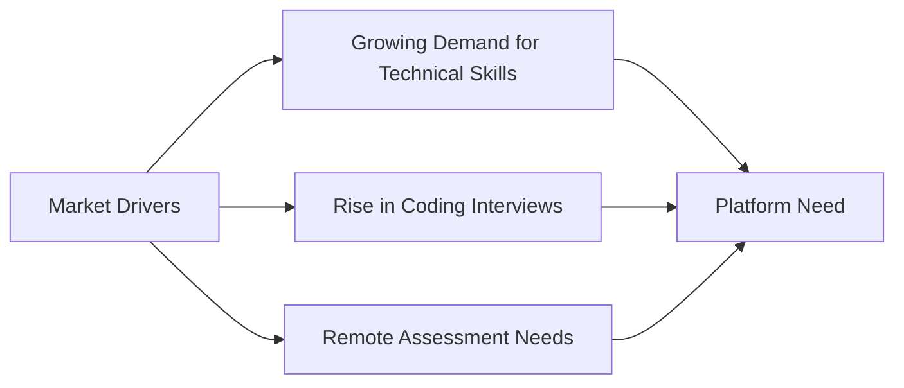
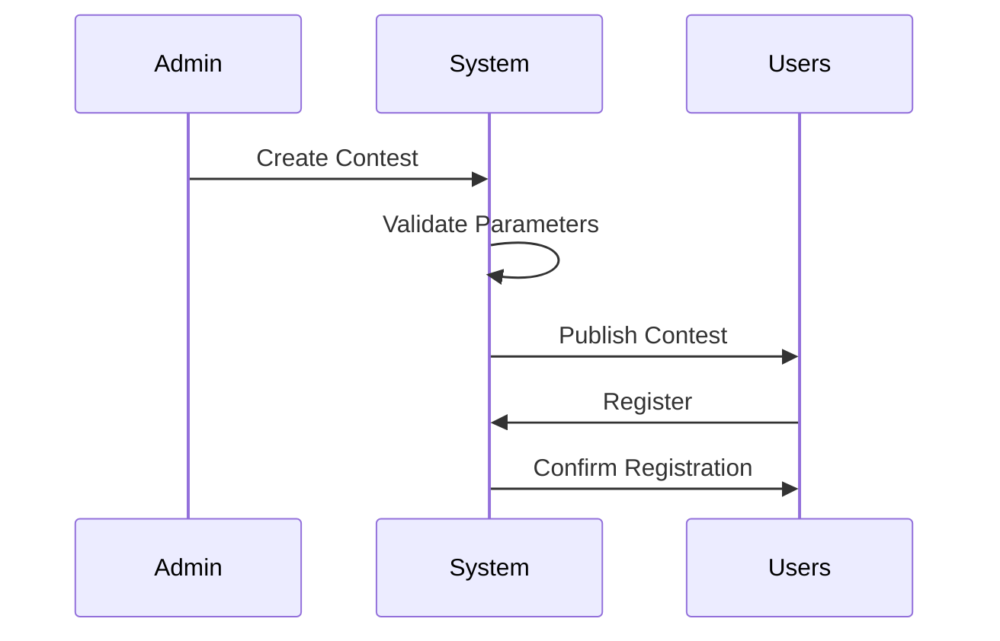
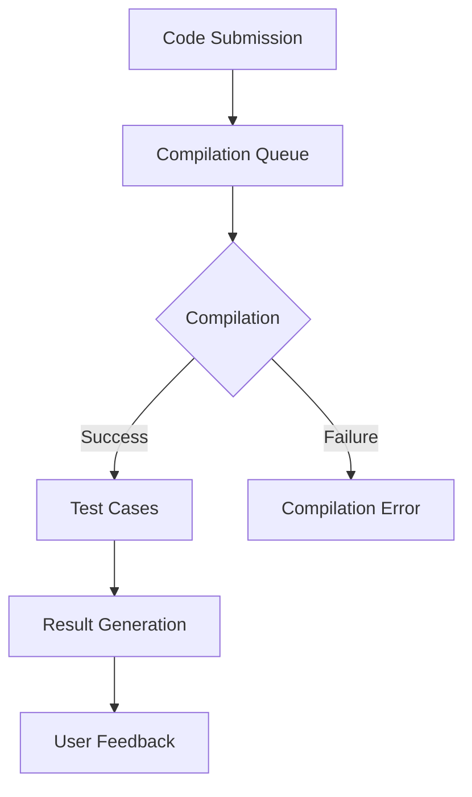
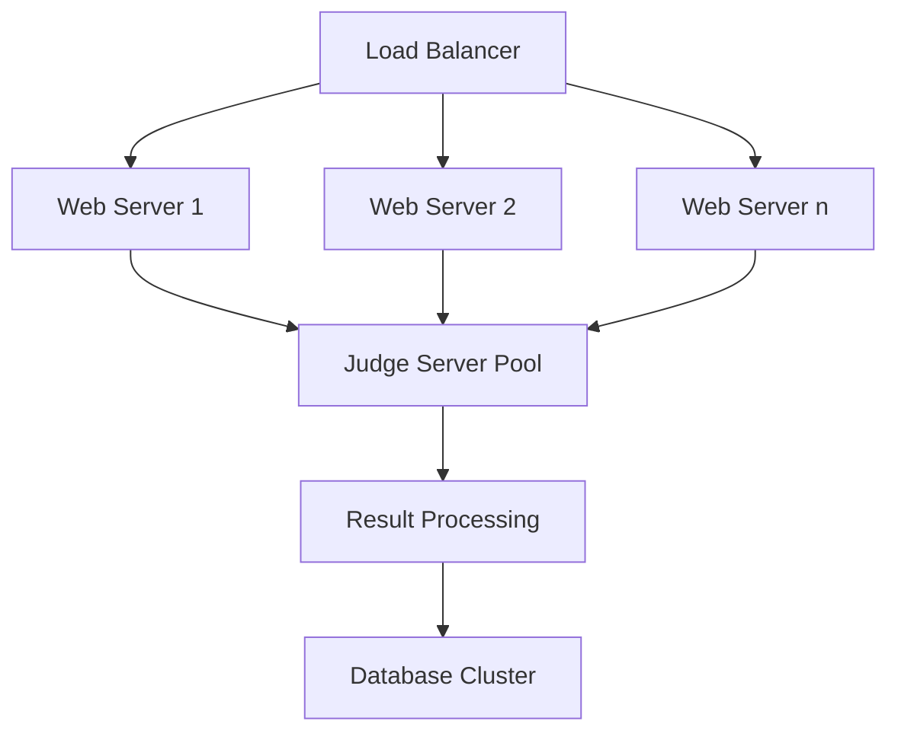
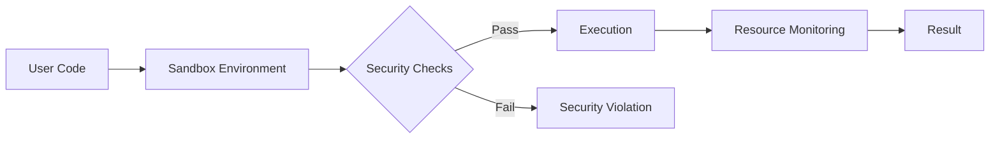

# User Requirements Document (URD)

## Executive Summary

At Hashcode, we are redefining competitive programming by creating a robust, scalable, and feature-rich platform for developers worldwide. Our goal is to combine algorithmic rigor with community engagement, catering to individual programmers, educators, and organizations. Drawing inspiration from platforms like Codeforces, LeetCode, and HackerRank, we aim to close gaps in reliability, accessibility, and innovation

Here’s what we’re building:

- A seamless experience for hosting real-time contests
- Comprehensive tools for learning and assessment
- A vibrant, collaborative programming community

---

## 1. Introduction

### 1.1 Purpose and Scope

The purpose of this document is to articulate the requirements for Hashcode with clarity and precision. It serves as the baseline for development, testing, and deployment while addressing the needs of stakeholders.

**What we aim to achieve:**

- Build a reliable platform for live contests.
- Provide a comprehensive learning hub for algorithmic problem-solving.
- Foster collaboration and innovation within our community.
- Enable organizations to conduct technical assessments with ease.


**What Hashcode will include:**

- Tools for individual problem-solving with progress tracking.
- A variety of contest formats with real-time scoring.
- Solutions for organizations needing candidate evaluation and bulk testing.
- Educational resources for instructors and learners.

### 1.2 Market Context

The demand for competitive programming platforms is growing rapidly, fueled by the increasing need for technical skills, coding interviews, and remote assessments.



## 2.Stakeholder Perspectives
### 2.1 Competitive Programmers
**"I want a platform that..."**
- Offers challenging and diverse problem sets
- Provides real-time, accurate solution evaluation
- Gives detailed feedback on my submissions
- Tracks my progress and rankings
- Prevents cheating and plagiarism

**My Pain Points:**
- Inconsistent judging systems
- Platform downtime during critical contests
- Limited learning resources
- Lack of personalized feedback
- Complex user interfaces

### 2.2 Administrators
**"I need tools that allow me to..."**
- Manage contests efficiently
- Moderate user-generated content
- Monitor platform performance
- Customize contest parameters
- Generate comprehensive analytics

**My Challenges:**
- Handling large-scale contests
- Ensuring fair competition
- Managing user permissions
- Tracking system health
- Resolving technical issues quickly

### 2.3 Educational Institutions
**"We require a platform that can..."**
- Support bulk student registrations
- Create private institutional contests
- Generate detailed performance reports
- Track student progress over time
- Integrate with existing learning management systems

**Our Concerns:**
- Student assessment accuracy
- Scalability during large-scale events
- Customization for different educational needs
- Protecting student data privacy

### 2.4 Sponsors and Organizations
**"We are looking for a platform that enables us to..."**
- Host branded coding events
- Assess technical skills
- Gain insights into candidate performance
- Customize contest parameters
- Reach a large pool of talented programmers

**Our Challenges:**
- Limited branding options
- Lack of detailed analytics
- Complex event management
- Difficulty in measuring candidate skills

### 2.5 Mentors and Coaches
**"I want a system that helps me..."**
- Track student performance
- Create custom problem sets
- Provide personalized guidance
- Monitor individual and team progress
- Access comprehensive learning analytics

**My Pain Points:**
- Limited visibility into student problem-solving strategies
- Lack of granular performance tracking
- Time-consuming manual assessment

### 2.6 System Administrators
**"Our priorities are..."**
- Ensuring high system availability
- Implementing robust security measures
- Monitoring server performance
- Quick issue resolution
- Scalable infrastructure

**Our Challenges:**
- Managing high-traffic events
- Preventing security breaches
- Maintaining system responsiveness
- Handling concurrent user loads

### 2.7 Event Organizers
**"We need a platform that supports..."**
- Easy event creation
- Flexible contest formats
- Real-time participant management
- Scalable infrastructure
- Comprehensive event analytics

**Our Challenges:**
- Complex event setup processes
- Limited customization options
- Handling international participants

### 2.8 Open Source Contributors
**"We want a platform with..."**
- Clear contribution guidelines
- Well-documented APIs
- Active community engagement
- Transparent development process
- Opportunities to improve the platform

**Our Motivations:**
- Enhancing platform capabilities
- Learning from collaborative development
- Building a robust open-source project

### 2.9 General Public
**"I'm interested in..."**
- Learning programming basics
- Casual problem-solving
- Free tutorials and resources
- Low-barrier entry to coding challenges
- Engaging and intuitive interface

**My Expectations:**
- Beginner-friendly content
- Step-by-step learning paths
- Supportive community
- Free access to basic features


---

## 3. User Requirements

The following table summarizes the user requirements gathered from personal interviews with various stakeholders:

| Stakeholder Group | Critical Requirements | Desired Features |
|------------------|----------------------|-----------------|
| Competitive Programmers | Real-time contest hosting, fair judging, detailed feedback | Advanced analytics, skill tracking |
| Administrators | Contest management, user moderation | Customizable contest parameters |
| Educational Institutions | Bulk registration, performance tracking | LMS integration |
| Sponsors | Branding options, performance analytics | Customized assessments |
| Mentors | Student progress tracking | Personalized learning paths |
| System Administrators | High availability, security | Automated monitoring |
| Event Organizers | Flexible contest formats | International support |
| Open Source Contributors | Clear documentation | Community engagement tools |
| General Public | Learning resources | Gamification elements |


---


## 4. Detailed Requirements

### 4.1 Contest Management System 🔴

#### 4.1.1 Contest Creation


We’re building a robust contest management system. Here’s what it includes:

1. Contest scheduling with timezone support
2. Multiple contest formats:
   - Standard (2-3 hours)
   - Long Challenge (1-7 days)
   - Short Sprint (30-60 minutes)
3. Customizable scoring systems


We’re also making it easy for participants with pre-registration, waitlisting, and automated reminders.

### 4.2 Code Submission System 🔴

#### 4.2.1 Submission Interface

For code submission, we’re focusing on reliability and speed. Submissions will have:

```javascript
interface SubmissionRequirements {
  maxSubmissionSize: '256KB';
  supportedLanguages: [
    'C++ 17',
    'Python 3.9+',
    'Java 11+',
    'JavaScript (Node.js 16+)',
    'Go 1.16+'
  ];
  timeLimit: '2000ms';
  memoryLimit: '256MB';
  compilationTimeout: '10s';
}
```

#### 4.2.2 Judge System Architecture



### 4.3 User Interface Requirements 🟡

#### 4.3.1 Problem Page Layout

Here’s how the problem page will look:

```
┌────────────────────────────────────────┐
│ Problem Title & Difficulty             │
├────────────────────────────────────────┤
│ Time Limit | Memory Limit | Input Type │
├────────────────────────────────────────┤
│ Problem Statement                      │
│                                        │
├────────────────────────────────────────┤
│ Input Format                           │
│ Output Format                          │
├────────────────────────────────────────┤
│ Sample Tests                           │
│ ┌────────────┐    ┌────────────┐      │
│ │ Input      │    │ Output     │      │
│ └────────────┘    └────────────┘      │
├────────────────────────────────────────┤
│ Code Editor                            │
│                                        │
└────────────────────────────────────────┘
```

### 4.4 Performance Requirements 🔴

#### 4.4.1 System Performance Metrics

| Metric             | Requirement        | Measurement Method       |
|--------------------|--------------------|--------------------------|
| Page Load Time     | < 2 seconds        | Google PageSpeed Insights |
| Submission Processing | < 5 seconds     | Server-side timing       |
| Concurrent Users   | 10,000+            | Load testing             |
| System Uptime      | 99.9%              | Monitoring tools         |

#### 4.4.2 Scalability Requirements



---

## 5. Security Requirements 🔴

### 5.1 Authentication System

- Multi-factor authentication support
- OAuth integration (Google, GitHub)
- Session management with JWT
- Rate limiting for API endpoints

### 5.2 Code Execution Security

- Use of containerized sandboxes to isolate user code execution.
- Automated resource capping to prevent denial-of-service (DoS) attacks.
- Static and dynamic security checks for code submissions.



---