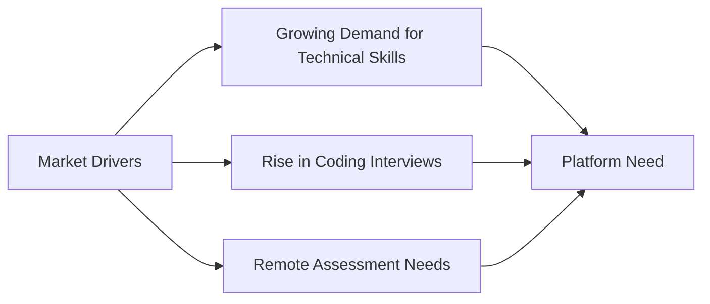
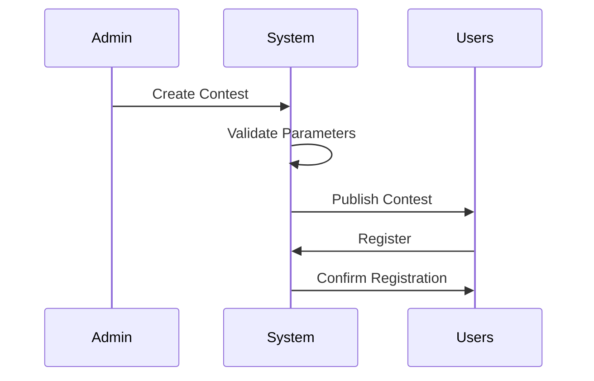
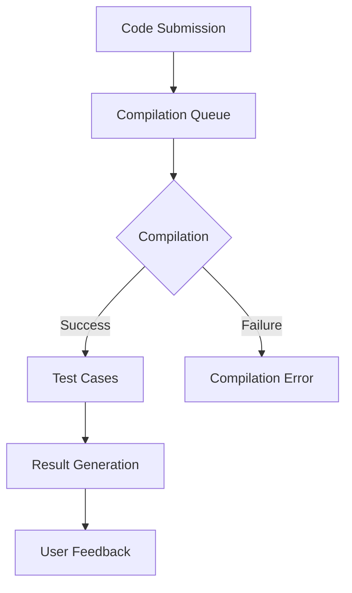
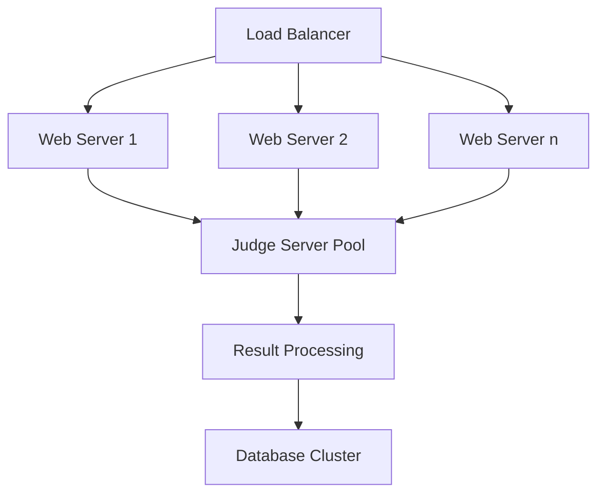
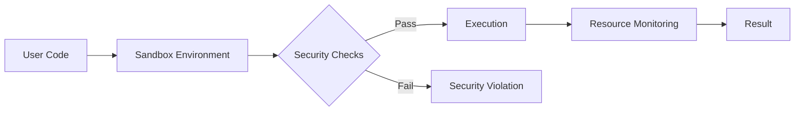
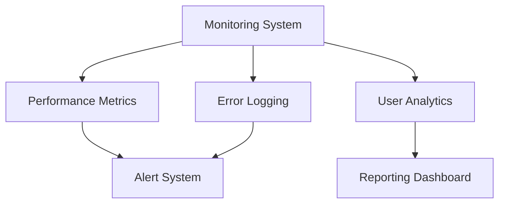

# User Requirements Document (URD)
## Hashcode: A Modern Competitive Programming Platform
### Version 1.0 | December 2024

 

---

## Executive Summary

Hashcode is set to redefine the competitive programming landscape by offering a robust, scalable, and feature-rich platform for developers worldwide. Combining algorithmic rigor with community engagement, it caters to both individual programmers and organizations. Inspired by leading platforms such as Codeforces, LeetCode, and HackerRank, Hashcode bridges gaps in reliability, accessibility, and innovation.

The platform aims to deliver:

- Seamless hosting of real-time contests
- Comprehensive tools for learning and assessment
- A vibrant community fostering collaboration and innovation

---

## 1. Introduction

### 1.1 Purpose and Scope

The purpose of this document is to articulate the requirements for Hashcode with clarity and precision. It serves as the baseline for development, testing, and deployment while addressing the needs of stakeholders.

**Key Objectives:**
- Develop a highly reliable platform for live contests.
- Provide a comprehensive learning hub for algorithmic problem-solving
- Foster a collaborative community of programmers
- Enable organizations to conduct technical assessments efficiently


**Scope**
- Individual problem-solving with analytics and progress tracking.
- Diverse contest formats with real-time scoring.
- Organizational needs, such as candidate evaluation and bulk testing.
- Educational tools for instructors and learners.

### 1.2 Market Context

The competitive programming platform market has seen significant growth:



### 1.3 Document Conventions

| Priority Level | Description | Symbol |
|---------------|-------------|---------|
| Critical | Must have for MVP | 🔴 |
| High | Important but not blocking | 🟡 |
| Medium | Desired feature | 🟢 |
| Low | Nice to have | ⚪ |

---

## 2. User Personas

### 2.1 Primary Users

#### 2.1.1 Competitive Programmer - "Mayank"
- **Background**: Computer Science student, 20 years old
- **Pain Points**:
  - Platform downtime during contests
  - Inconsistent judging systems
  - Limited feedback on solutions
 
#### 2.1.2 Competitive Programmer - "Karan"
- **Background**: Information technology student, 20 years old
- **Pain Points**:
  - Regular Cheating in contest
  - Plagiarism Detection
  - Repeated Questions


---

## 3. User Requirements

The following table summarizes the user requirements gathered from personal interviews with various stakeholders:

| User                    | Requirement                      | Description                                                                                   |
|-------------------------|----------------------------------|-----------------------------------------------------------------------------------------------|
| Competitive Programmers | Real-time contest hosting        | Ability to participate in real-time contests with minimal downtime.                           |
| Competitive Programmers | Detailed feedback                | Receive consistent and detailed feedback on submitted solutions.                              |
| Competitive Programmers | Large-scale contest management   | Tools to manage and host large-scale contests efficiently.                                    |
| Competitive Programmers | Performance analytics            | Access to detailed analytics on candidate performance.                                        |
| Competitive Programmers | Intuitive problem creation       | A user-friendly interface for creating and managing problem sets.                             |
| Competitive Programmers | Plagiarism detection             | Robust mechanisms to detect and prevent plagiarism.                                           |
| Students                | Progress tracking                | Tools to monitor and track student progress over time.                                        |
| Developer               | System health monitoring         | Real-time monitoring of system health and performance.                                        |
| General Public          | Learning resources               | Access to tutorials and learning materials for algorithmic problem-solving.                   |

---

## 4. Detailed Requirements

### 4.1 Contest Management System 🔴

#### 4.1.1 Contest Creation


**Required Features for contest creation:**
1. Contest scheduling with timezone support
2. Multiple contest formats:
   - Standard (2-3 hours)
   - Long Challenge (1-7 days)
   - Short Sprint (30-60 minutes)
3. Customizable scoring systems

**Required Features for Participant Management:**
1. Pre-registration and waitlisting
2. Automated reminders and notifications

### 4.2 Code Submission System 🔴

#### 4.2.1 Submission Interface

The platform must support a robust code submission system with the following capabilities:

```javascript
interface SubmissionRequirements {
  maxSubmissionSize: '256KB';
  supportedLanguages: [
    'C++ 17',
    'Python 3.9+',
    'Java 11+',
    'JavaScript (Node.js 16+)',
    'Go 1.16+'
  ];
  timeLimit: '2000ms';
  memoryLimit: '256MB';
  compilationTimeout: '10s';
}
```

#### 4.2.2 Judge System Architecture



### 4.3 User Interface Requirements 🟡

#### 4.3.1 Problem Page Layout

The problem page must follow this structured layout:

```
┌────────────────────────────────────────┐
│ Problem Title & Difficulty             │
├────────────────────────────────────────┤
│ Time Limit | Memory Limit | Input Type │
├────────────────────────────────────────┤
│ Problem Statement                      │
│                                        │
├────────────────────────────────────────┤
│ Input Format                           │
│ Output Format                          │
├────────────────────────────────────────┤
│ Sample Tests                           │
│ ┌────────────┐    ┌────────────┐      │
│ │ Input      │    │ Output     │      │
│ └────────────┘    └────────────┘      │
├────────────────────────────────────────┤
│ Code Editor                            │
│                                        │
└────────────────────────────────────────┘
```

### 4.4 Performance Requirements 🔴

#### 4.4.1 System Performance Metrics

| Metric             | Requirement        | Measurement Method       |
|--------------------|--------------------|--------------------------|
| Page Load Time     | < 2 seconds        | Google PageSpeed Insights |
| Submission Processing | < 5 seconds     | Server-side timing       |
| Concurrent Users   | 10,000+            | Load testing             |
| System Uptime      | 99.9%              | Monitoring tools         |

#### 4.4.2 Scalability Requirements



---

## 5. Security Requirements 🔴

### 5.1 Authentication System

- Multi-factor authentication support
- OAuth integration (Google, GitHub)
- Session management with JWT
- Rate limiting for API endpoints

### 5.2 Code Execution Security

- Use of containerized sandboxes to isolate user code execution.
- Automated resource capping to prevent denial-of-service (DoS) attacks.
- Static and dynamic security checks for code submissions.



---

## 6. Integration Requirements 🟡

### 6.1 External System Integration

The platform must integrate with:

1. **Version Control Systems**
   - GitHub
   - GitLab
   - Bitbucket

2. **Learning Management Systems**
   - Canvas
   - Moodle
   - Blackboard

3. **Authentication Providers**
   - Google OAuth
   - GitHub OAuth
   - Microsoft Azure AD

---

## 7. Maintenance and Support 🟢

### 7.1 System Monitoring



### 7.2 Support Requirements

- 24/7 technical support for critical issues
- Maximum 4-hour response time for contest-related issues
- Community forum moderation
- Regular system maintenance windows

---

## 8. Future Considerations 🟢

### 8.1 Planned Features

1. **AI-Driven Analysis**
   - Automated code review
   - Performance optimization suggestions
   - Pattern recognition for similar solutions

2. **Advanced Analytics**
   - Skill progression tracking
   - Performance prediction
   - Learning path recommendations

---

## Document Control

| Version | Date       | Author        | Changes         |
|---------|------------|---------------|-----------------|
| 1.0     | 2024-12-06 | Hashcode Team | Initial Release |
| 1.1     | TBD        | -             | Planned Update  |

---

## Appendices

### Appendix A: Glossary of Terms

| Term            | Definition                        |
|-----------------|-----------------------------------|
| Contest Rating  | A numerical value representing a user's performance |
| Virtual Contest | A simulation of a past contest    |
| Judge System    | Automated code evaluation system  |

### Appendix B: Reference Documents

1. IEEE 830-1998 Standard
2. SWEBOK v3.0
3. ISO/IEC/IEEE 29148:2018

Refer to the [Software Engineering Body of Knowledge (SWEBOK)](https://www.computer.org/education/bodies-of-knowledge/software-engineering/v4) for guidance.

