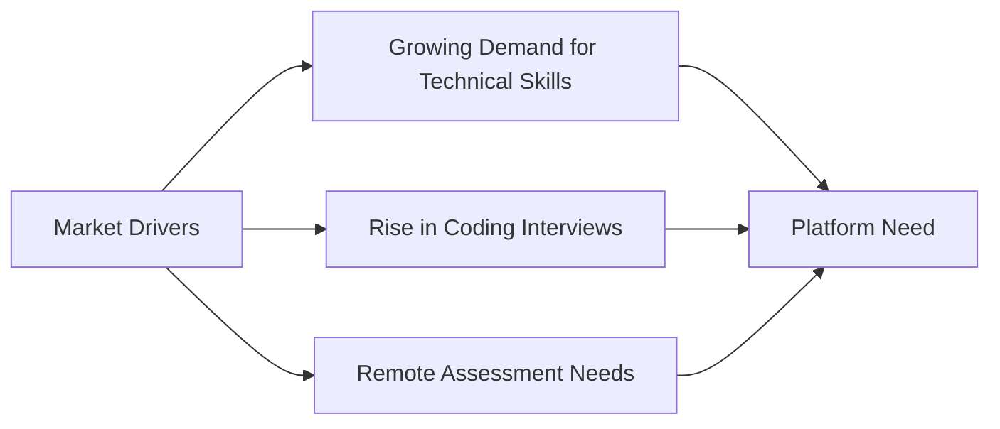
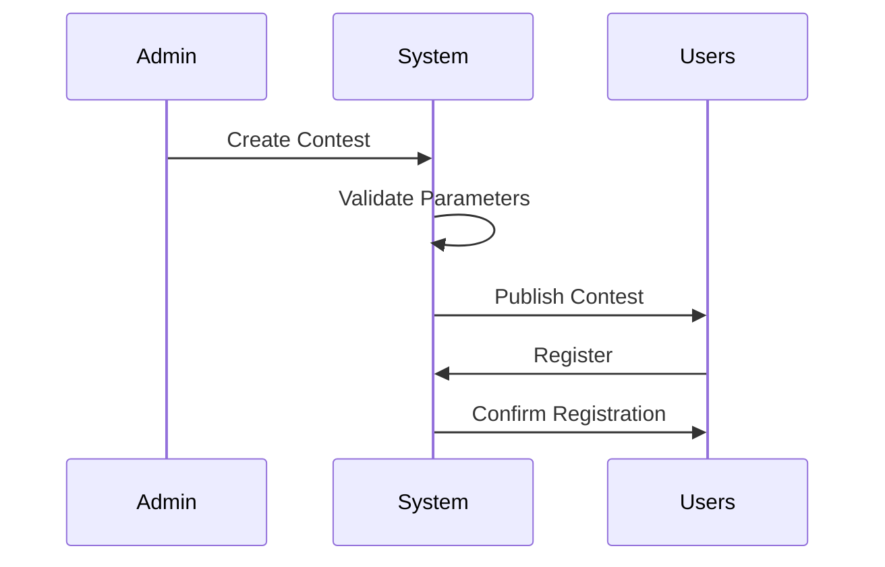
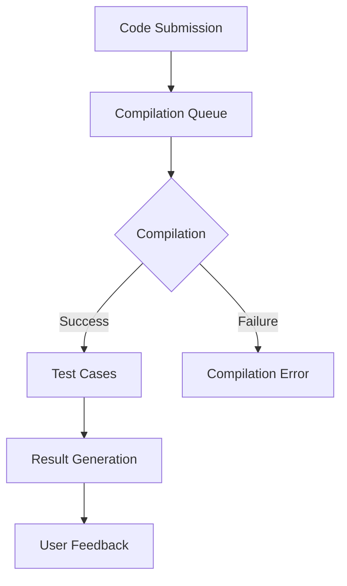
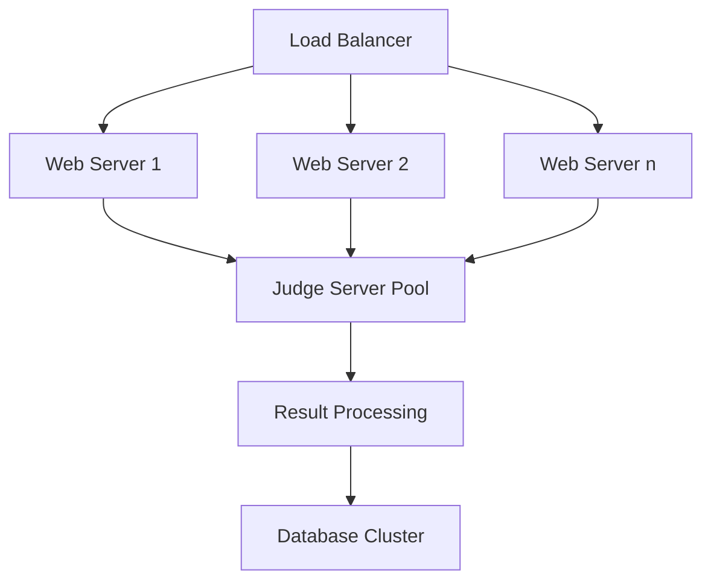
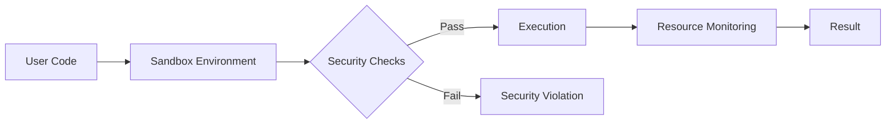
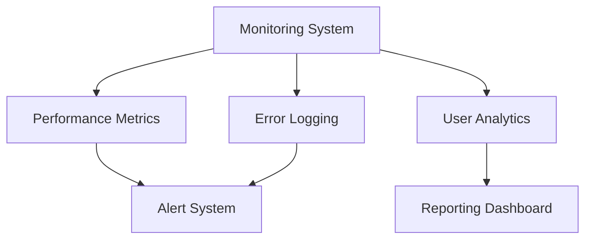

# User Requirements Document (URD)
## Hashcode: A Modern Competitive Programming Platform
### Version 1.0 | December 2024

 

---

## Executive Summary

Hashcode is set to redefine the competitive programming landscape by offering a robust, scalable, and feature-rich platform for developers worldwide. Combining algorithmic rigor with community engagement, it caters to both individual programmers and organizations. Inspired by leading platforms such as Codeforces, LeetCode, and HackerRank, Hashcode bridges gaps in reliability, accessibility, and innovation.

The platform aims to deliver:

- Seamless hosting of real-time contests
- Comprehensive tools for learning and assessment
- A vibrant community fostering collaboration and innovation

---

## 1. Introduction

### 1.1 Purpose and Scope

The purpose of this document is to articulate the requirements for Hashcode with clarity and precision. It serves as the baseline for development, testing, and deployment while addressing the needs of stakeholders.

**Key Objectives:**
- Develop a highly reliable platform for live contests.
- Provide a comprehensive learning hub for algorithmic problem-solving
- Foster a collaborative community of programmers
- Enable organisations to conduct technical assessments efficiently


**Scope**
- Individual problem-solving with analytics and progress tracking.
- Diverse contest formats with real-time scoring.
- Organisational needs, such as candidate evaluation and bulk testing.
- Educational tools for instructors and learners.


### 1.2 Market Context

The competitive programming platform market has seen significant growth:



### 1.3 Document Conventions

| Priority Level | Description | Symbol |
|---------------|-------------|---------|
| Critical | Must have for MVP | 🔴 |
| High | Important but not blocking | 🟡 |
| Medium | Desired feature | 🟢 |
| Low | Nice to have | ⚪ |

---

## 2. User Personas

### 2.1 Primary Users

#### 2.1.1 Competitive Programmer - "Alex"
- **Background**: Computer Science student, 20 years old
- **Goals**: 
  - Improve algorithmic problem-solving skills
  - Participate in rated contests
  - Achieve high ranking
- **Pain Points**:
  - Platform downtime during contests
  - Inconsistent judging systems
  - Limited feedback on solutions

#### 2.1.2 Corporate Recruiter - "Sarah"
- **Background**: Technical Recruiter at a Fortune 500 company
- **Goals**:
  - Host large scale, company-specific contests
  - Access detailed candidate performance analytics
  - Customize problem sets for assessment
- **Pain Points**:
  - Difficulty in managing large-scale contests logistics
  - Limited candidate evaluation metrics
  - Lack of integration with HR systems

### 2.2 Secondary Users

#### 2.2.1 Content Creator - "Prof. Zhang"
- **Background**: University Professor
- **Goals**:
  - Create educational problem sets
  - Monitor student progress
  - Share teaching resources
- **Pain Points**:
  - Complex problem creation interface
  - Limited collaborative features
  - Inadequate plagiarism detection


### Use Case 1: Competitive Programmers

| Use Case ID | UC-01 |
|-------------|-------|
| Name | User Registration |
| Actors | User, System |
| Description | A user registers an account by providing an email, username, and password. |
| Preconditions | User has access to the registration page. |
| Postconditions | User account is created and verification email is sent. |
| Main Flow | 1. User navigates to registration page. <br>2. User fills in email, username, and password. <br>3. System validates inputs. <br>4. System creates user account. <br>5. System sends verification email. |
| Alternative Flows | A1: Email already in use. <br>A2: Invalid input data. |

### Use Case 2: Administrators

| Use Case ID | UC-02 |
|-------------|-------|
| Name | Contest Creation |
| Actors | Administrator, System |
| Description | An administrator creates a new contest by setting up its details and adding problems. |
| Preconditions | Administrator is logged in and has access to the contest creation interface. |
| Postconditions | New contest is created and available for users to join. |
| Main Flow | 1. Administrator navigates to contest creation page. <br>2. Administrator enters contest details. <br>3. Administrator selects problems for the contest. <br>4. System validates and saves the contest details. <br>5. Contest is published and visible to users. |
| Alternative Flows | A1: Invalid contest details. <br>A2: Problems not found. |

### Use Case 3: Developers

| Use Case ID | UC-03 |
|-------------|-------|
| Name | Code Deployment |
| Actors | Developer, System |
| Description | A developer deploys new code updates to the platform. |
| Preconditions | Developer has access to the code repository and deployment tools. |
| Postconditions | New code is deployed and platform is updated. |
| Main Flow | 1. Developer commits code changes to repository. <br>2. Developer initiates deployment process. <br>3. System builds and tests the new code. <br>4. System deploys the new code to production. <br>5. Platform is updated with new features or fixes. |
| Alternative Flows | A1: Build fails. <br>A2: Tests fail. |

### Use Case 4: Sponsors and Organizations

| Use Case ID | UC-04 |
|-------------|-------|
| Name | Sponsor Contest |
| Actors | Sponsor, System |
| Description | A sponsor sets up a sponsored contest with custom branding and settings. |
| Preconditions | Sponsor is registered and logged in. |
| Postconditions | Sponsored contest is created and promoted on the platform. |
| Main Flow | 1. Sponsor navigates to contest sponsorship page. <br>2. Sponsor enters contest details and custom branding. <br>3. Sponsor sets contest rules and prizes. <br>4. System validates and saves the contest details. <br>5. Sponsored contest is published and promoted. |
| Alternative Flows | A1: Invalid contest details. <br>A2: Branding assets not uploaded. |

### Use Case 5: Educational Institutions

| Use Case ID | UC-05 |
|-------------|-------|
| Name | Bulk Student Registration |
| Actors | Educator, System |
| Description | An educator registers multiple students for a private contest. |
| Preconditions | Educator is registered and logged in. |
| Postconditions | Students are registered and added to the private contest. |
| Main Flow | 1. Educator navigates to bulk registration page. <br>2. Educator uploads student details file. <br>3. System validates and registers students. <br>4. System adds students to the private contest. <br>5. Confirmation is sent to educator. |
| Alternative Flows | A1: Invalid student details file. <br>A2: Students already registered. |

### Use Case 6: Mentors and Coaches

| Use Case ID | UC-06 |
|-------------|-------|
| Name | Track Student Progress |
| Actors | Mentor, System |
| Description | A mentor tracks the progress of their students over time. |
| Preconditions | Mentor is registered and logged in. Students are registered and assigned to the mentor. |
| Postconditions | Mentor views detailed progress reports for students. |
| Main Flow | 1. Mentor navigates to student progress page. <br>2. Mentor selects student or group of students. <br>3. System displays detailed progress reports. <br>4. Mentor reviews and provides feedback. |
| Alternative Flows | A1: No student data available. <br>A2: Invalid student selection. |

### Use Case 7: System Administrators

| Use Case ID | UC-07 |
|-------------|-------|
| Name | Monitor System Health |
| Actors | System Administrator, System |
| Description | A system administrator monitors the health and performance of the platform. |
| Preconditions | System administrator has access to monitoring tools. |
| Postconditions | System health and performance metrics are displayed. |
| Main Flow | 1. System administrator navigates to monitoring dashboard. <br>2. System administrator views real-time metrics. <br>3. System administrator sets up alerts for potential issues. <br>4. System displays alerts and logs. <br>5. System administrator takes corrective actions if needed. |
| Alternative Flows | A1: Monitoring tools unavailable. <br>A2: Invalid metrics display. |

### Use Case 8: Event Organizers

| Use Case ID | UC-08 |
|-------------|-------|
| Name | Host Large-Scale Event |
| Actors | Event Organizer, System |
| Description | An event organizer hosts a large-scale competitive programming event. |
| Preconditions | Event organizer is registered and logged in. |
| Postconditions | Large-scale event is set up and managed on the platform. |
| Main Flow | 1. Event organizer navigates to event setup page. <br>2. Event organizer enters event details and custom settings. <br>3. System validates and saves event details. <br>4. System scales resources for large event. <br>5. Event is hosted and monitored for performance. |
| Alternative Flows | A1: Invalid event details. <br>A2: Resource scaling issues. |

### Use Case 9: Open Source Contributors

| Use Case ID | UC-09 |
|-------------|-------|
| Name | Contribute to Codebase |
| Actors | Contributor, System |
| Description | An open source contributor submits code changes to the platform. |
| Preconditions | Contributor has access to the code repository. |
| Postconditions | Code changes are reviewed and merged into the main codebase. |
| Main Flow | 1. Contributor forks the repository and makes code changes. <br>2. Contributor submits pull request. <br>3. System runs automated tests on pull request. <br>4. Maintainers review and approve pull request. <br>5. Code changes are merged into the main codebase. |
| Alternative Flows | A1: Tests fail. <br>A2: Pull request rejected. |

### Use Case 10: General Public

| Use Case ID | UC-10 |
|-------------|-------|
| Name | Access Learning Resources |
| Actors | Casual User, System |
| Description | A casual user accesses tutorials and learning resources on the platform. |
| Preconditions | User has access to the platform. |
| Postconditions | User views and utilizes learning resources. |
| Main Flow | 1. User navigates to learning resources page. <br>2. User selects a tutorial or guide. <br>3. System displays the selected resource. <br>4. User follows the tutorial or guide. |
| Alternative Flows | A1: Resource not found. <br>A2: Invalid resource selection. |

---

## 3. Detailed Requirements

### 3.1 Contest Management System 🔴

#### 3.1.1 Contest Creation


**Required Features for contest creation :**
1. Contest scheduling with timezone support
2. Multiple contest formats:
   - Standard (2-3 hours)
   - Long Challenge (1-7 days)
   - Short Sprint (30-60 minutes)
3. Customizable scoring systems

**Required Features for Participant Management :**
1. Pre-registration and waitlisting
2. Automated reminders and notifications

### 3.2 Code Submission System 🔴

#### 3.2.1 Submission Interface

The platform must support a robust code submission system with the following capabilities:

```javascript
interface SubmissionRequirements {
  maxSubmissionSize: '256KB';
  supportedLanguages: [
    'C++ 17',
    'Python 3.9+',
    'Java 11+',
    'JavaScript (Node.js 16+)',
    'Go 1.16+'
  ];
  timeLimit: '2000ms';
  memoryLimit: '256MB';
  compilationTimeout: '10s';
}
```

#### 3.2.2 Judge System Architecture



### 3.3 User Interface Requirements 🟡

#### 3.3.1 Problem Page Layout

The problem page must follow this structured layout:

```
┌────────────────────────────────────────┐
│ Problem Title & Difficulty             │
├────────────────────────────────────────┤
│ Time Limit | Memory Limit | Input Type │
├────────────────────────────────────────┤
│ Problem Statement                      │
│                                        │
├────────────────────────────────────────┤
│ Input Format                           │
│ Output Format                          │
├────────────────────────────────────────┤
│ Sample Tests                           │
│ ┌────────────┐    ┌────────────┐      │
│ │ Input      │    │ Output     │      │
│ └────────────┘    └────────────┘      │
├────────────────────────────────────────┤
│ Code Editor                            │
│                                        │
└────────────────────────────────────────┘
```

### 3.4 Performance Requirements 🔴

#### 3.4.1 System Performance Metrics

| Metric | Requirement | Measurement Method |
|--------|-------------|-------------------|
| Page Load Time | < 2 seconds | Google PageSpeed Insights |
| Submission Processing | < 5 seconds | Server-side timing |
| Concurrent Users | 10,000+ | Load testing |
| System Uptime | 99.9% | Monitoring tools |

#### 3.4.2 Scalability Requirements



---

## 4. Security Requirements 🔴

### 4.1 Authentication System

- Multi-factor authentication support
- OAuth integration (Google, GitHub)
- Session management with JWT
- Rate limiting for API endpoints

### 4.2 Code Execution Security

- Use of containerized sandboxes to isolate user code execution.
- Automated resource capping to prevent denial-of-service (DoS) attacks.
- Static and dynamic security checks for code submissions.



---

## 5. Integration Requirements 🟡

### 5.1 External System Integration

The platform must integrate with:

1. **Version Control Systems**
   - GitHub
   - GitLab
   - Bitbucket

2. **Learning Management Systems**
   - Canvas
   - Moodle
   - Blackboard

3. **Authentication Providers**
   - Google OAuth
   - GitHub OAuth
   - Microsoft Azure AD

---

## 6. Legal and Compliance Requirements 🔴

### 6.1 Data Protection

- GDPR compliance for EU users
- CCPA compliance for California users
- Data encryption at rest and in transit
- Regular security audits and penetration testing

### 6.2 Accessibility Requirements

- WCAG 2.1 Level AA compliance
- Screen reader compatibility
- Keyboard navigation support
- Color contrast requirements

---

## 7. Maintenance and Support 🟢

### 7.1 System Monitoring



### 7.2 Support Requirements

- 24/7 technical support for critical issues
- Maximum 4-hour response time for contest-related issues
- Community forum moderation
- Regular system maintenance windows

---

## 8. Future Considerations 🟢

### 8.1 Planned Features

1. **AI-Driven Analysis**
   - Automated code review
   - Performance optimization suggestions
   - Pattern recognition for similar solutions

2. **Advanced Analytics**
   - Skill progression tracking
   - Performance prediction
   - Learning path recommendations

---

## Document Control

| Version | Date | Author | Changes |
|---------|------|---------|---------|
| 1.0 | 2024-12-06 | Hashcode Team | Initial Release |
| 1.1 | TBD | - | Planned Update |

---

## Appendices

### Appendix A: Glossary of Terms

| Term | Definition |
|------|------------|
| Contest Rating | A numerical value representing a user's performance |
| Virtual Contest | A simulation of a past contest |
| Judge System | Automated code evaluation system |

### Appendix B: Reference Documents

1. IEEE 830-1998 Standard
2. SWEBOK v3.0
3. ISO/IEC/IEEE 29148:2018

Refer to the [Software Engineering Body of Knowledge (SWEBOK)](https://www.computer.org/education/bodies-of-knowledge/software-engineering/v4) for guidance.

---

