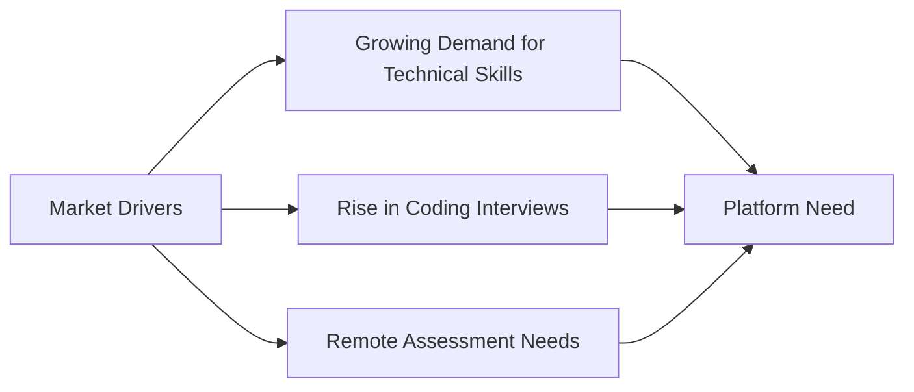
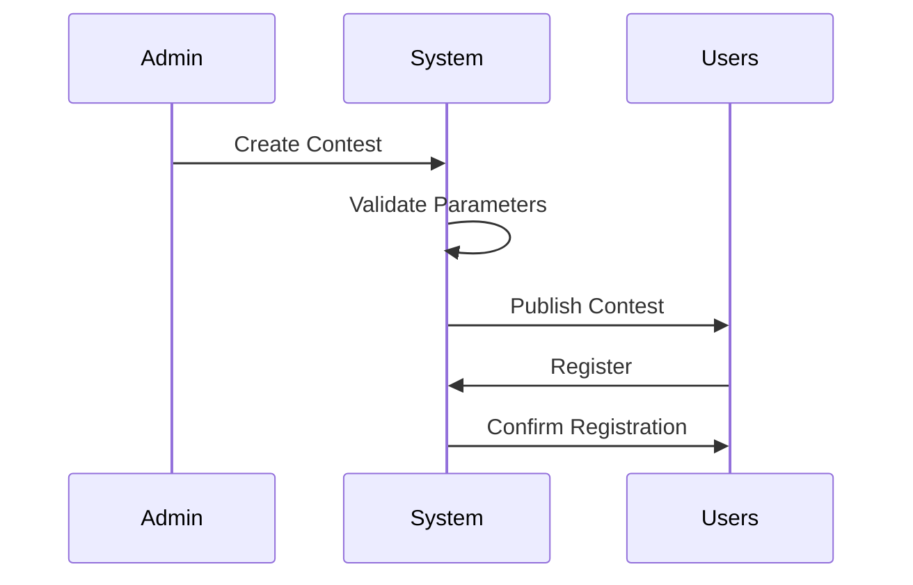
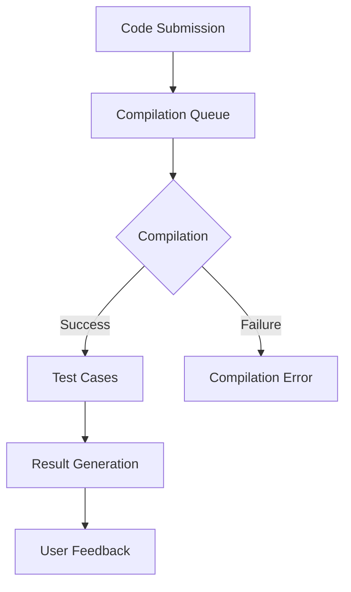
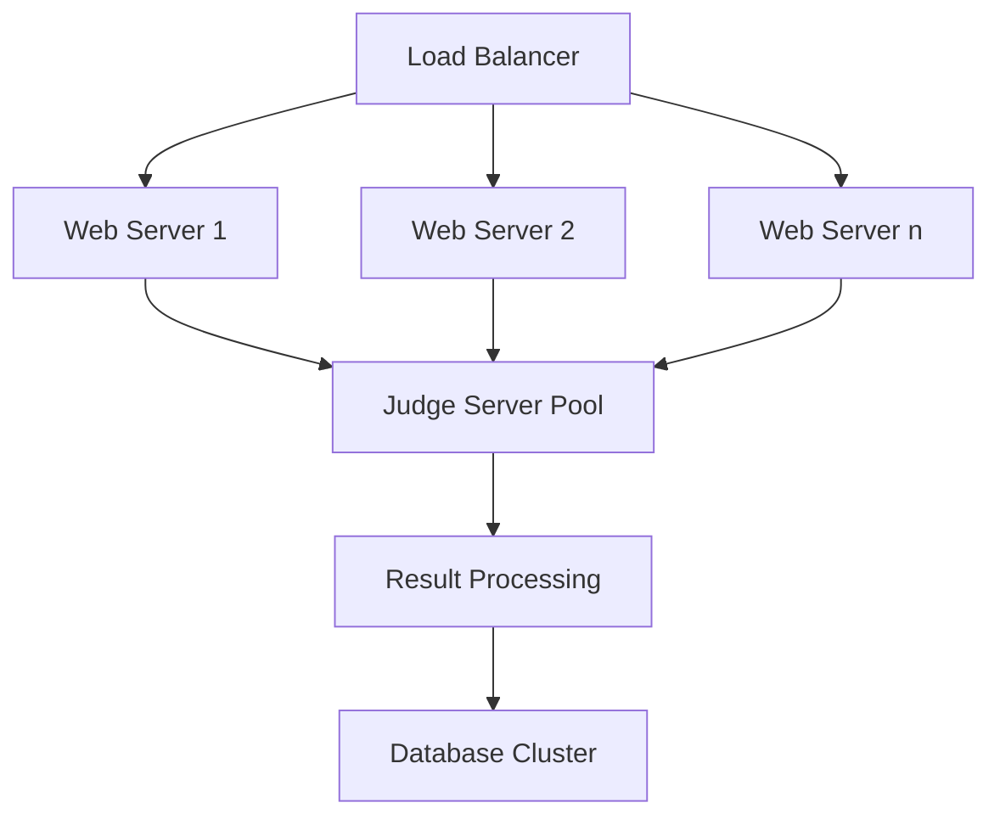
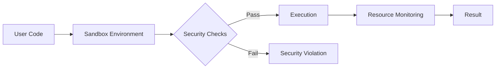
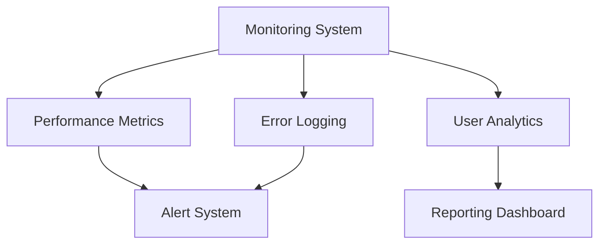

# User Requirements Document (URD)
## CompeteCode: A Modern Competitive Programming Platform
### Version 1.0 | October 2024

 

---

## Executive Summary

CompeteCode aims to revolutionize the competitive programming landscape by providing a robust, scalable platform that combines the rigor of algorithmic challenges with the engagement of a vibrant community. Drawing inspiration from successful platforms like Codeforces, LeetCode, and HackerRank, CompeteCode addresses the growing demand for high-quality programming practice and assessment tools.

---

## 1. Introduction

### 1.1 Purpose and Scope

This URD outlines the comprehensive requirements for CompeteCode, a next-generation competitive programming platform. The document serves as the foundation for system design, development, and validation, ensuring alignment between stakeholder needs and platform capabilities.

**Key Objectives:**
- Create a reliable platform for hosting real-time programming contests
- Provide a comprehensive learning environment for algorithmic problem-solving
- Foster a collaborative community of programmers
- Enable organizations to conduct technical assessments efficiently

### 1.2 Market Context

The competitive programming platform market has seen significant growth:



### 1.3 Document Conventions

| Priority Level | Description | Symbol |
|---------------|-------------|---------|
| Critical | Must have for MVP | 🔴 |
| High | Important but not blocking | 🟡 |
| Medium | Desired feature | 🟢 |
| Low | Nice to have | ⚪ |

---

## 2. User Personas

### 2.1 Primary Users

#### 2.1.1 Competitive Programmer - "Alex"
- **Background**: Computer Science student, 20 years old
- **Goals**: 
  - Improve algorithmic problem-solving skills
  - Participate in rated contests
  - Achieve high ranking
- **Pain Points**:
  - Inconsistent judging systems
  - Limited feedback on solutions
  - Platform downtime during contests

#### 2.1.2 Corporate Recruiter - "Sarah"
- **Background**: Technical Recruiter at a Fortune 500 company
- **Goals**:
  - Host company-specific contests
  - Access detailed candidate performance analytics
  - Customize problem sets for assessment
- **Pain Points**:
  - Difficulty in managing large-scale contests
  - Limited candidate evaluation metrics
  - Integration with HR systems

### 2.2 Secondary Users

#### 2.2.1 Content Creator - "Prof. Zhang"
- **Background**: University Professor
- **Goals**:
  - Create educational problem sets
  - Monitor student progress
  - Share teaching resources
- **Pain Points**:
  - Complex problem creation interface
  - Limited collaborative features
  - Inadequate plagiarism detection

---

## 3. Detailed Requirements

### 3.1 Contest Management System 🔴

#### 3.1.1 Contest Creation


**Required Features:**
1. Contest scheduling with timezone support
2. Multiple contest formats:
   - Standard (2-3 hours)
   - Long Challenge (1-7 days)
   - Short Sprint (30-60 minutes)
3. Customizable scoring systems

**Real-world Example:**
> Google Kickstart's round structure serves as a benchmark, where participants compete in 3-hour rounds with increasing problem difficulty.

### 3.2 Code Submission System 🔴

#### 3.2.1 Submission Interface

The platform must support a robust code submission system with the following capabilities:

```javascript
interface SubmissionRequirements {
  maxSubmissionSize: '256KB';
  supportedLanguages: [
    'C++ 17',
    'Python 3.9+',
    'Java 11+',
    'JavaScript (Node.js 16+)',
    'Go 1.16+'
  ];
  timeLimit: '2000ms';
  memoryLimit: '256MB';
  compilationTimeout: '10s';
}
```

#### 3.2.2 Judge System Architecture



### 3.3 User Interface Requirements 🟡

#### 3.3.1 Problem Page Layout

The problem page must follow this structured layout:

```
┌────────────────────────────────────────┐
│ Problem Title & Difficulty             │
├────────────────────────────────────────┤
│ Time Limit | Memory Limit | Input Type │
├────────────────────────────────────────┤
│ Problem Statement                      │
│                                        │
├────────────────────────────────────────┤
│ Input Format                           │
│ Output Format                          │
├────────────────────────────────────────┤
│ Sample Tests                           │
│ ┌────────────┐    ┌────────────┐      │
│ │ Input      │    │ Output     │      │
│ └────────────┘    └────────────┘      │
├────────────────────────────────────────┤
│ Code Editor                            │
│                                        │
└────────────────────────────────────────┘
```

### 3.4 Performance Requirements 🔴

#### 3.4.1 System Performance Metrics

| Metric | Requirement | Measurement Method |
|--------|-------------|-------------------|
| Page Load Time | < 2 seconds | Google PageSpeed Insights |
| Submission Processing | < 5 seconds | Server-side timing |
| Concurrent Users | 10,000+ | Load testing |
| System Uptime | 99.9% | Monitoring tools |

#### 3.4.2 Scalability Requirements



---

## 4. Security Requirements 🔴

### 4.1 Authentication System

- Multi-factor authentication support
- OAuth integration (Google, GitHub)
- Session management with JWT
- Rate limiting for API endpoints

### 4.2 Code Execution Security



---

## 5. Integration Requirements 🟡

### 5.1 External System Integration

The platform must integrate with:

1. **Version Control Systems**
   - GitHub
   - GitLab
   - Bitbucket

2. **Learning Management Systems**
   - Canvas
   - Moodle
   - Blackboard

3. **Authentication Providers**
   - Google OAuth
   - GitHub OAuth
   - Microsoft Azure AD

---

## 6. Legal and Compliance Requirements 🔴

### 6.1 Data Protection

- GDPR compliance for EU users
- CCPA compliance for California users
- Data encryption at rest and in transit
- Regular security audits and penetration testing

### 6.2 Accessibility Requirements

- WCAG 2.1 Level AA compliance
- Screen reader compatibility
- Keyboard navigation support
- Color contrast requirements

---

## 7. Maintenance and Support 🟢

### 7.1 System Monitoring



### 7.2 Support Requirements

- 24/7 technical support for critical issues
- Maximum 4-hour response time for contest-related issues
- Community forum moderation
- Regular system maintenance windows

---

## 8. Future Considerations 🟢

### 8.1 Planned Features

1. **AI-Powered Code Analysis**
   - Automated code review
   - Performance optimization suggestions
   - Pattern recognition for similar solutions

2. **Advanced Analytics**
   - Skill progression tracking
   - Performance prediction
   - Learning path recommendations

---

## Document Control

| Version | Date | Author | Changes |
|---------|------|---------|---------|
| 1.0 | 2024-10-29 | CompeteCode Team | Initial Release |
| 1.1 | TBD | - | Planned Update |

---

## Appendices

### Appendix A: Glossary of Terms

| Term | Definition |
|------|------------|
| Contest Rating | A numerical value representing a user's performance |
| Virtual Contest | A simulation of a past contest |
| Judge System | Automated code evaluation system |

### Appendix B: Reference Documents

1. IEEE 830-1998 Standard
2. SWEBOK v3.0
3. ISO/IEC/IEEE 29148:2018