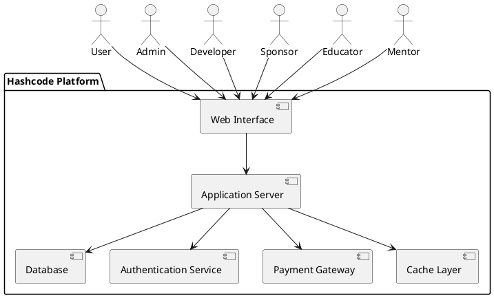
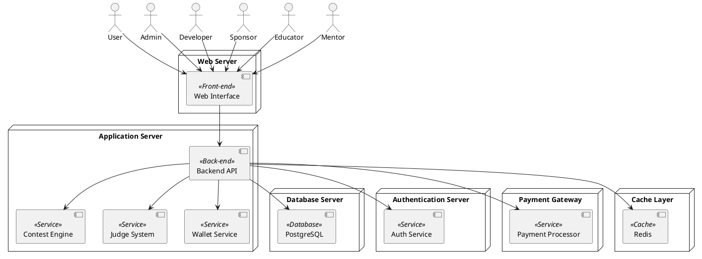
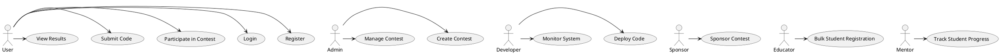
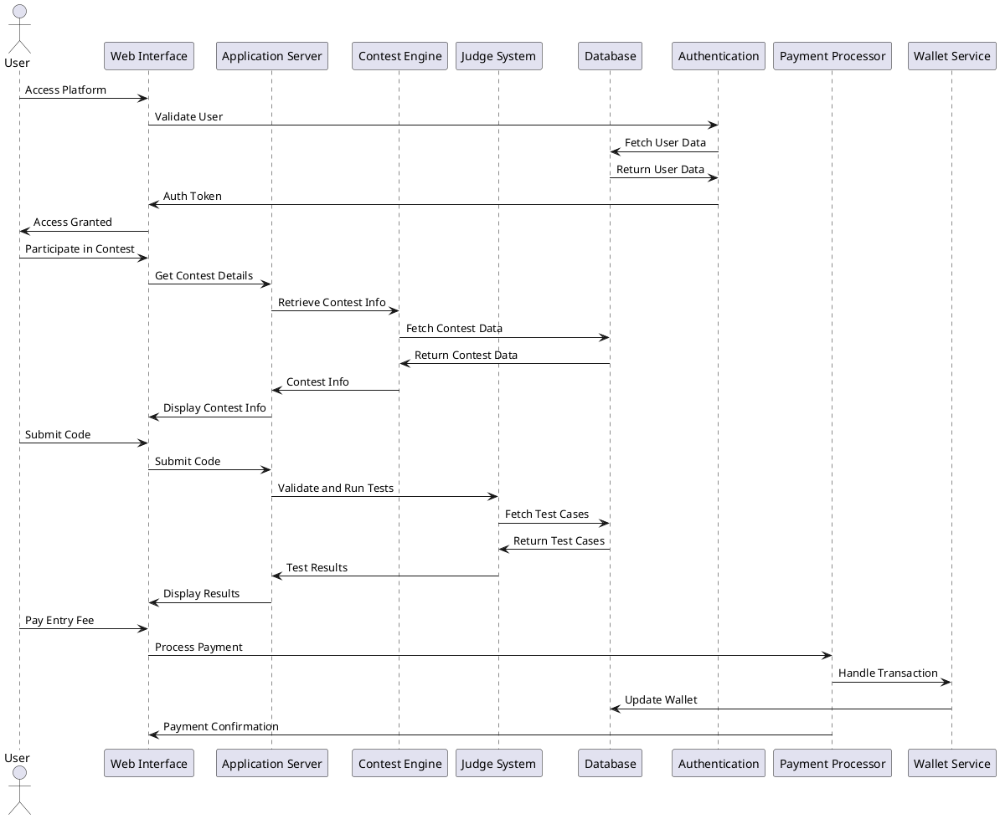
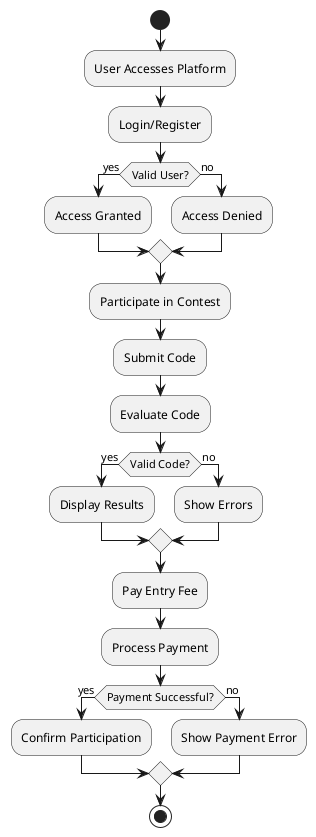

### Architecture of Hashcode Platform

#### Introduction
This document provides a comprehensive overview of the architecture of the Hashcode platform, detailing various components and their interactions. The diagrams aim to be highly detailed to reflect a real-world project setup.

### System Context Diagram

### Container Diagram

### Code Component Diagram

```plantuml
@startuml
package "Web Interface" {
    class ReactApp {
        +render()
        +handleSubmit()
    }
}

package "Backend API" {
    class NodeApp {
        +handleRequest()
        +validateData()
    }
    class ContestEngine {
        +createContest()
        +manageContest()
    }
    class JudgeSystem {
        +evaluateCode()
    }
    class WalletService {
        +handleTransactions()
        +processPayments()
    }
}

package "Database" {
    class PostgreSQL {
        +storeData()
        +retrieveData()
    }
}

package "Auth Service" {
    class Auth {
        +login()
        +register()
    }
}

package "Payment Processor" {
    class Payment {
        +processEntryFees()
        +distributePrizes()
    }
}

package "Cache Layer" {
    class Redis {
        +cacheData()
        +retrieveCache()
    }
}

ReactApp -> NodeApp : sends request
NodeApp -> ContestEngine : delegates contest logic
NodeApp -> JudgeSystem : delegates code evaluation
NodeApp -> WalletService : handles financial transactions
NodeApp -> PostgreSQL : interacts with database
NodeApp -> Auth : handles authentication
NodeApp -> PaymentProcessor : handles payments
NodeApp -> Redis : caches data

@enduml
```

### Use Case Diagram

### Sequence Diagram

### Activity Diagram

### Conclusion
The detailed architecture of the Hashcode platform is designed to be modular, scalable, and efficient, ensuring a robust environment for competitive programming. The use of PlantUML diagrams helps in visualizing the interactions and structure of the platform's components.

---

Documented by Team InnovateCS  
IIIT Lucknow - Software Engineering Project 2024
