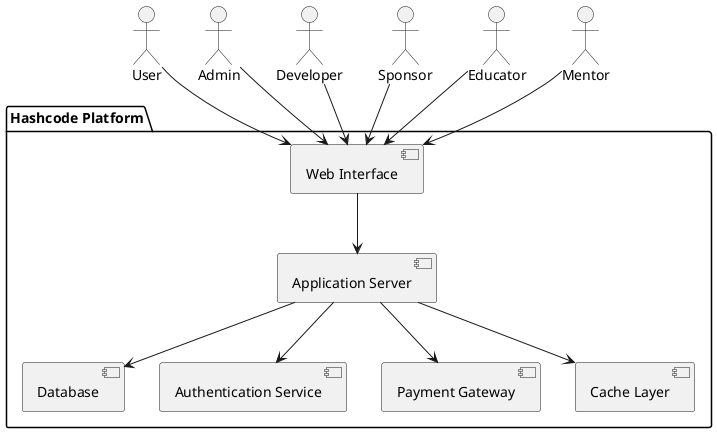
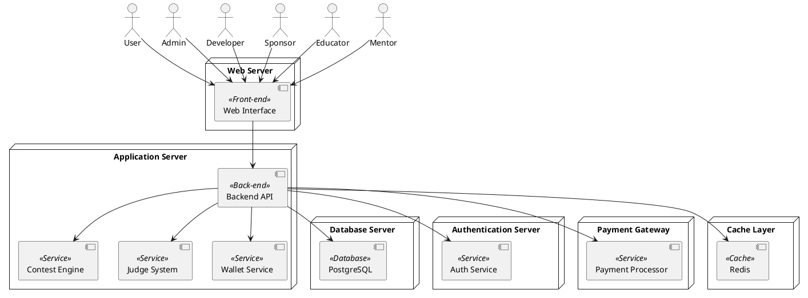
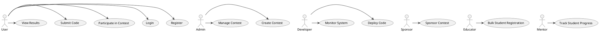
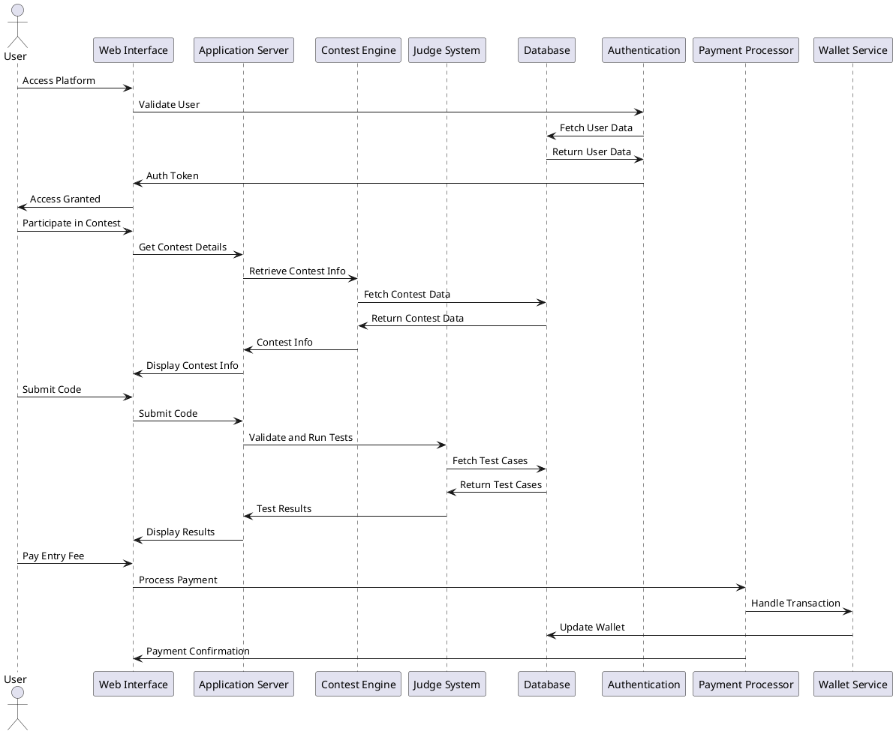
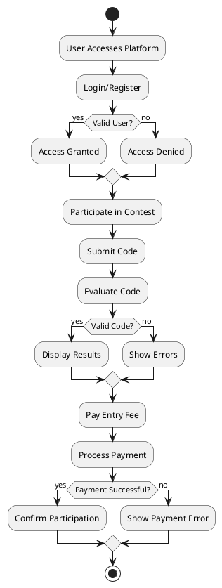
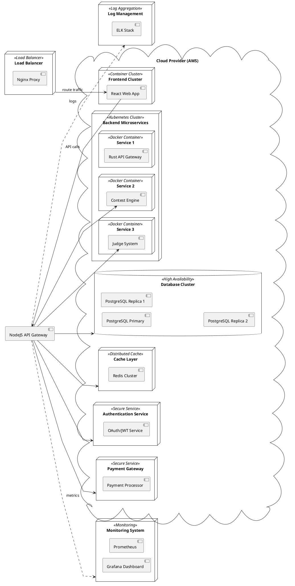

### Architecture of Hashcode Platform

#### Introduction
This document provides an in-depth architectural overview of the Hashcode platform, a next-generation competitive programming ecosystem. It focuses on detailing the various components and their interactions, with the intent to ensure scalability, reliability, and optimal user experience. The architectural diagrams are meticulously crafted to reflect a real-world implementation.

### System Context Diagram

This diagram outlines the key stakeholders and their interaction with the Hashcode platform. It provides a high-level understanding of the platform’s major components and the flow of information.

### Container Diagram

The container diagram provides a detailed breakdown of the components that form the Hashcode platform, emphasizing their roles and relationships.

### Code Component Diagram

```plantuml
@startuml
package "Web Interface" {
    class ReactApp {
        +render()
        +handleSubmit()
    }
}

package "Backend API" {
    class NodeApp {
        +handleRequest()
        +validateData()
    }
    class ContestEngine {
        +createContest()
        +manageContest()
    }
    class JudgeSystem {
        +evaluateCode()
    }
    class WalletService {
        +handleTransactions()
        +processPayments()
    }
}

package "Database" {
    class PostgreSQL {
        +storeData()
        +retrieveData()
    }
}

package "Auth Service" {
    class Auth {
        +login()
        +register()
    }
}

package "Payment Processor" {
    class Payment {
        +processEntryFees()
        +distributePrizes()
    }
}

package "Cache Layer" {
    class Redis {
        +cacheData()
        +retrieveCache()
    }
}

ReactApp -> NodeApp : sends request
NodeApp -> ContestEngine : delegates contest logic
NodeApp -> JudgeSystem : delegates code evaluation
NodeApp -> WalletService : handles financial transactions
NodeApp -> PostgreSQL : interacts with database
NodeApp -> Auth : handles authentication
NodeApp -> PaymentProcessor : handles payments
NodeApp -> Redis : caches data

@enduml
```

The component diagram represents the logical organization of the Hashcode platform, delineating the responsibilities of each module.

### Use Case Diagram

This diagram illustrates the primary actions that various users can perform on the platform.

### Sequence Diagram

The sequence diagram maps out the interactions between components when a user accesses the platform, participates in a contest, and submits a solution.

### Activity Diagram

The activity diagram outlines the sequence of operations a user performs on the platform.

### Deployment Diagram

The deployment diagram provides an infrastructure-level view of the Hashcode platform, ensuring it meets requirements for scalability, fault tolerance, and performance.

### Conclusion
The architecture of the Hashcode platform is designed to be modular, scalable, and resilient, ensuring a seamless experience for all users. By leveraging industry-standard tools and practices, this architecture lays a strong foundation for future growth and feature expansions.

---

Documented by Team InnovateCS  
IIIT Lucknow - Software Engineering Project 2024
