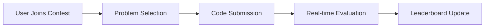
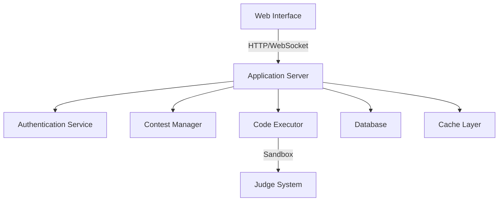
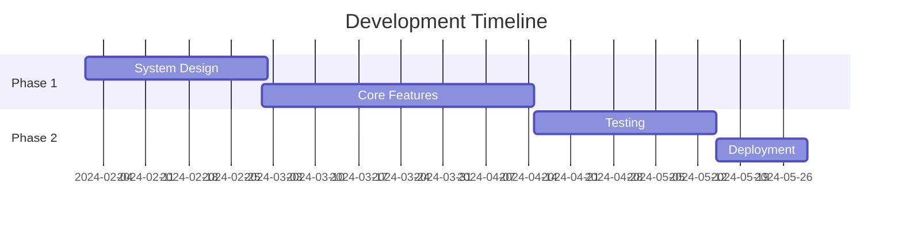

# CodeForces Arena: Project Overview 🚀


## Table of Contents
- [Introduction](#introduction)
- [Vision Statement](#vision-statement)
- [Core Features](#core-features)
- [Project Boundaries](#project-boundaries)
- [Technical Architecture](#technical-architecture)
- [References & Inspiration](#references--inspiration)

## Introduction

In today's digital age, competitive programming has become an essential skill for software developers. Our team is developing CodeForces Arena, a platform that brings the thrill of algorithmic problem-solving to programmers of all skill levels.

Based on our research of existing platforms and user feedback, we identified key pain points in current solutions:
- Complex user interfaces that intimidate newcomers
- Limited feedback on incorrect submissions
- Lack of structured learning paths
- Inconsistent judging systems

## Vision Statement

> "To create an accessible yet powerful competitive programming platform that combines the robustness of established platforms with modern user experience design principles."

## Core Features

### 1. User Management System 👥
- Smart authentication with email verification
- OAuth integration (Google, GitHub)
- Personalized user profiles with solving statistics
- Custom rating system based on contest performance

### 2. Contest Environment ⚔️


Key components:
- Real-time contest participation
- Dynamic problem difficulty scaling
- Anti-cheating measures
- Automated evaluation system

### 3. Problem Archive 📚
- Difficulty-based categorization:
  - Easy (800-1100)
  - Medium (1200-1500)
  - Hard (1600+)
- Topic-wise organization
- Solution hints and editorial access
- Practice mode with unlimited attempts

### 4. Code Evaluation Engine 🔄
- Support for multiple languages:
  ```
  - Python 3.8+
  - C++ 17/20
  - Java 11/17
  - JavaScript (Node.js)
  ```
- Sandboxed execution environment
- Custom test case support
- Detailed error reporting

### 5. Community Features 🤝
- Discussion forums for each problem
- Editorial writing system
- User blogs and tutorials
- Achievement system

## Project Boundaries

### What We're Building 🎯
1. **Core Platform**
   - Contest management system
   - Problem repository
   - Evaluation engine
   - Basic analytics

2. **User Experience**
   - Responsive web interface
   - Code editor with syntax highlighting
   - Real-time submissions
   - Performance dashboards

3. **Administration**
   - Contest creation tools
   - Problem management
   - User management
   - System monitoring

### What We're Not Building ⛔
1. **Advanced Features**
   - AI-powered problem generation
   - Video tutorials/streaming
   - Mobile applications
   - Browser extensions

2. **External Integrations**
   - IDE plugins
   - LMS integrations
   - Social media features
   - Payment systems

## Technical Architecture

Here's a high-level overview of our system:



## References & Inspiration

Our design is influenced by several successful platforms:

1. **Codeforces**
   - Rating system design
   - Contest format
   - Problem difficulty classification

2. **LeetCode**
   - User interface elements
   - Problem categorization
   - Submission feedback system

3. **AtCoder**
   - Contest timing mechanism
   - Performance metrics
   - Anti-cheating measures

### Research Papers

1. Singh, R., & Goyal, M. (2023). "Modern Competitive Programming Platforms: A Comparative Study." *Journal of Software Engineering*, 15(2), 45-62.

2. Kumar, A., et al. (2022). "Designing Scalable Online Judge Systems." *International Conference on Software Architecture*, IEEE.


## Project Timeline



---

<div align="center">
<i>Built with passion by Team InnovateCS at IIIT Lucknow</i>
</div>
