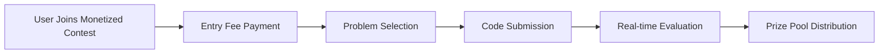
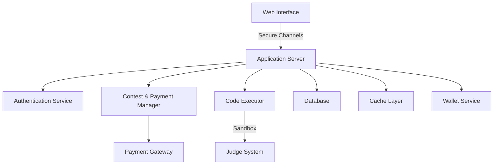

# Upsolve : Online Competitive Coding Platform 🚀💰

## Table of Contents
- [Introduction](#introduction)
- [Vision Statement](#vision-statement)
- [Core Features](#core-features)
- [Project Boundaries](#project-boundaries)
- [Technical Architecture](#technical-architecture)
- [References & Inspiration](#references--inspiration)

## Introduction

In today's digital age, competitive programming has become an essential skill for software developers. Our team is developing Upsolve, a platform that brings the thrill of algorithmic problem-solving to programmers of all skill levels, with a unique monetization twist.

Based on our research of existing platforms and user feedback, we identified key pain points in current solutions:
- Complex user interfaces that intimidate newcomers, making it difficult for beginners to explore or practice.
- Limited feedback on incorrect submissions, resulting in slower learning and discouragement.
- Lack of structured learning paths that help users navigate topics progressively.
- Inconsistent judging systems which can lead to frustration with unfair or inaccurate scoring.
- Limited motivation and engagement beyond learning and ranking.

## Vision Statement

> "To create an accessible and innovative competitive programming platform that combines robust learning experiences with exciting monetary challenges, empowering developers to grow their skills and earn rewards."

Our goal is to revolutionize competitive programming by offering an intuitive, engaging platform that not only educates but also provides tangible economic incentives for excellence.

## Core Features

### 1. User Management System 👥💳

An enhanced user management system that prioritizes security, personalization, and financial integration:
- **Smart Authentication**: Includes multi-factor authentication and email verification for security.
- **OAuth Integration**: Allows users to log in with Google, GitHub, or other supported services.
- **Wallet Integration**: Secure digital wallet for contest entries, earnings, and withdrawals.
- **Personalized Profiles**: Comprehensive dashboards displaying solved problems, language preferences, skill ratings, achievement badges, and earnings history.
- **Custom Rating System**: Combines performance ratings with monetary achievements.

### 2. Monetized Contest Environment ⚔️💰

A revolutionary contest system that adds financial stakes to competitive programming:

Key monetization components:
- **Stake-based Contests**: 
  - Users can enter contests by paying an entry fee
  - Entry fees are pooled to create prize money for top performers
  - Transparent prize distribution based on ranking and performance
- **Tiered Monetary Rewards**: 
  - Different contest tiers with varying entry fees and prize pools
  - Ensures opportunities for programmers at all skill levels
- **Skill-based Matchmaking**: Contests matched by rating to ensure fair competition
- **Anti-cheating Measures**: Advanced plagiarism detection and monitoring to maintain contest integrity

### 3. Problem Archive 📚

Enhanced problem archive with improved learning and earning potential:
- **Difficulty-based Categorization**: Problems range from Easy (800-1100), Medium (1200-1500), to Hard (1600+).
- **Monetized Practice Challenges**: 
  - Optional paid challenges with smaller prize pools
  - Allows users to earn while practicing
- **Topic-wise Organization**: Problems categorized by technical domains
- **Solution Hints and Editorials**: Provides learning resources
- **Practice Mode**: Unlimited attempts with performance tracking

### 4. Code Evaluation Engine 🔄

Robust evaluation system with enhanced features:
- **Multi-language Support**: Python 3.8+, C++ 17/20, Java 11/17, JavaScript
- **Sandboxed Execution**: Secure code evaluation
- **Detailed Performance Analytics**: 
  - Comprehensive code performance metrics
  - Insights for skill improvement
  - Potential monetization of high-quality solutions

### 5. Community and Earning Features 🤝💸

Community features that promote learning and financial opportunities:
- **Discussion Forums**: Problem-specific discussion boards
- **Solution Marketplace**: 
  - Users can sell high-quality problem solutions
  - Rewards for creating valuable educational content
- **Referral Program**: 
  - Earn credits or a percentage of referral's first contest entry
- **Achievement System**: 
  - Monetary rewards for reaching specific milestones
  - Badges and recognition for top performers

## Project Boundaries

### What We're Building 🎯
1. **Core Platform**
   - Monetized contest management
   - Secure payment integration
   - Comprehensive problem repository
   - Fair and transparent prize distribution system

2. **Financial Features**
   - Secure digital wallet
   - Multiple payment method support
   - Transparent fee and prize tracking
   - Withdrawal mechanisms

3. **User Experience**
   - Responsive, intuitive web interface
   - Real-time contest and earnings tracking
   - Performance and financial dashboards

### What We're Not Building ⛔
1. **Advanced Features**
   - Full cryptocurrency integration
   - Complete financial trading platform
   - Mobile applications (initial phase)

2. **External Integrations**
   - Direct bank transfers
   - Advanced financial derivatives

## Technical Architecture

Additional architectural considerations:
- Secure, scalable payment infrastructure
- Robust fraud detection mechanisms
- Compliance with financial regulations

## References & Inspiration

Influenced by:
1. Codeforces (Contest Structure)
2. LeetCode (Learning Platform)
3. Kaggle (Monetary Challenges)
4. eSports Platforms (Competitive Monetization)

### Research References
1. Singh, R., & Goyal, M. (2023). "Monetization in Online Learning Platforms."
2. Kumar, A., et al. (2022). "Designing Scalable Online Judge Systems with Financial Integration."

<i>Innovatively Built by Team InnovateCS at IIIT Lucknow</i>

