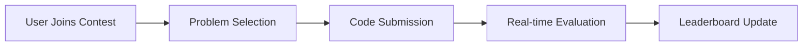
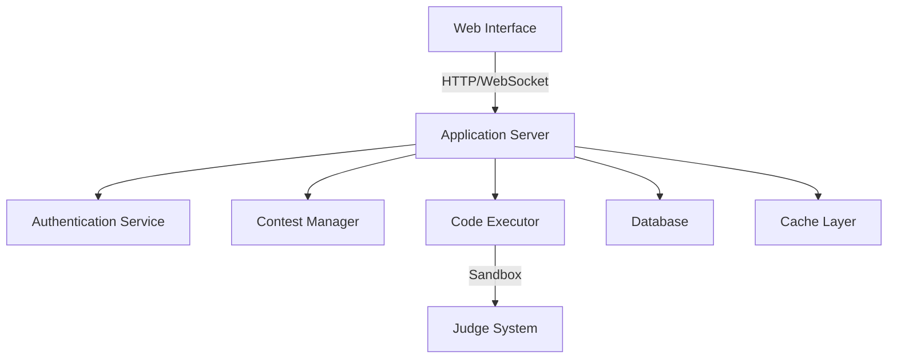

# Upsolve : Online Competitive Coding Platform 🚀

## Table of Contents
- [Introduction](#introduction)
- [Vision Statement](#vision-statement)
- [Core Features](#core-features)
- [Project Boundaries](#project-boundaries)
- [Technical Architecture](#technical-architecture)
- [References & Inspiration](#references--inspiration)

## Introduction

In today's digital age, competitive programming has become an essential skill for software developers. Our team is developing Upsolve, a platform that brings the thrill of algorithmic problem-solving to programmers of all skill levels.

Based on our research of existing platforms and user feedback, we identified key pain points in current solutions:
- Complex user interfaces that intimidate newcomers, making it difficult for beginners to explore or practice.
- Limited feedback on incorrect submissions, resulting in slower learning and discouragement.
- Lack of structured learning paths that help users navigate topics progressively.
- Inconsistent judging systems which can lead to frustration with unfair or inaccurate scoring.

## Vision Statement

> "To create an accessible yet powerful competitive programming platform that combines the robustness of established platforms with modern user experience design principles."

Our goal is to bridge the gap between beginner-friendly and professional-level competitive programming sites by offering intuitive navigation, meaningful feedback, and engaging content for continuous skill development.

## Core Features

### 1. User Management System 👥

A robust user management system that prioritizes security, personalization, and ease of access:
- **Smart Authentication**: Includes multi-factor authentication and email verification for security.
- **OAuth Integration**: Allows users to log in with Google, GitHub, or other supported services, minimizing friction for new users.
- **Personalized Profiles**: Users will have a comprehensive dashboard displaying solved problems, language preferences, skill ratings, and achievement badges.
- **Custom Rating System**: Similar to Codeforces, the rating system adjusts based on contest performance, providing an ongoing, competitive element.

### 2. Contest Environment ⚔️

The contest environment is designed to replicate the competitive experience:

Key components:
- **Real-time Contest Participation**: Users can join ongoing contests and see their rank update live.
- **Dynamic Problem Difficulty Scaling**: Problems are ranked according to difficulty, with scores weighted to reward those solving tougher challenges.
- **Anti-cheating Measures**: Prevents unfair practices using plagiarism detection and IP-based monitoring.
- **Automated Evaluation System**: Judging is handled by a highly optimized evaluation engine with low latency, ensuring accurate results.

### 3. Problem Archive 📚

A categorized problem archive ensures users can practice effectively:
- **Difficulty-based Categorization**: Problems range from Easy (800-1100), Medium (1200-1500), to Hard (1600+).
- **Topic-wise Organization**: Users can search by topics such as graphs, dynamic programming, sorting, and data structures.
- **Solution Hints and Editorials**: Provides hints and detailed explanations for problems, aiding in learning.
- **Practice Mode**: Users can attempt problems multiple times and get instant feedback, allowing unlimited practice.

### 4. Code Evaluation Engine 🔄

A robust code execution engine ensures consistent performance:
- **Multi-language Support**: Supports Python 3.8+, C++ 17/20, Java 11/17, and JavaScript (Node.js), allowing flexibility for programmers.
- **Sandboxed Execution Environment**: Isolates user code to prevent malicious activity and ensures accurate grading.
- **Custom Test Case Support**: Users can test their code with custom inputs to validate logic.
- **Detailed Error Reporting**: Provides comprehensive error messages to help users understand issues in their code.

### 5. Community Features 🤝

Community features foster collaboration and learning:
- **Discussion Forums**: Each problem will have a dedicated discussion forum, allowing users to seek help and share insights.
- **Editorial Writing System**: Users can contribute solutions and tutorials, fostering a collaborative learning environment.
- **User Blogs and Tutorials**: Experienced programmers can write blogs on advanced topics, adding value to the community.
- **Achievement System**: Users earn achievements based on their activity, encouraging regular participation and progression.

## Project Boundaries

### What We're Building 🎯
1. **Core Platform**
   - **Contest Management System**: Supports user-created contests and a global leaderboard for real-time participation.
   - **Problem Repository**: Hosts a diverse range of problems, from beginner to advanced difficulty levels.
   - **Evaluation Engine**: A reliable and efficient judging system that ensures fair results.
   - **Basic Analytics**: Provides performance data, including average solution times, accuracy rates, and user metrics.

2. **User Experience**
   - **Responsive Web Interface**: Ensures accessibility on various devices.
   - **Code Editor with Syntax Highlighting**: Provides an intuitive coding experience, supporting autocompletion and real-time code analysis.
   - **Real-time Submissions**: Allows users to see submission results instantly, reducing waiting times.
   - **Performance Dashboards**: Users can track their progress, strengths, and areas for improvement.

3. **Administration**
   - **Contest Creation Tools**: Enables administrators to create and manage contests easily.
   - **Problem Management**: Allows for adding, updating, or categorizing problems.
   - **User Management**: Enables moderators to manage user accounts and enforce community guidelines.
   - **System Monitoring**: Tracks server load, submission success rate, and platform uptime.

### What We're Not Building ⛔
1. **Advanced Features**
   - AI-driven problem generation.
   - Interactive video tutorials or streaming.
   - Mobile applications or browser extensions (initially).

2. **External Integrations**
   - IDE plugins and LMS integration.
   - Social media or payment systems.

## Technical Architecture

Here's a high-level overview of our system's structure, enabling scalability and responsiveness:

- **Web Interface**: Provides an interactive UI, powered by React or Vue.js, ensuring a smooth user experience.
- **Application Server**: Manages requests and maintains contest and user data.
- **Authentication Service**: Secures logins and manages user sessions.
- **Contest Manager**: Controls contest activities and monitors active users.
- **Code Executor**: A dedicated service for evaluating submissions in a secure, sandboxed environment.
- **Judge System**: Scores each submission based on accuracy and efficiency.
- **Database**: Stores user information, contest details, and problem sets.
- **Cache Layer**: Boosts performance by reducing database load for frequently accessed data.

## References & Inspiration

Our design is influenced by several successful platforms:

1. **Codeforces**: Robust rating system, contest format, and difficulty classification.
2. **LeetCode**: Modern interface, feedback-driven submission system, and topic-based categorization.
3. **AtCoder**: Precise contest timing, advanced metrics, and effective anti-cheating practices.

### Research Papers

1. Singh, R., & Goyal, M. (2023). "Modern Competitive Programming Platforms: A Comparative Study." *Journal of Software Engineering*, 15(2), 45-62.
2. Kumar, A., et al. (2022). "Designing Scalable Online Judge Systems." *International Conference on Software Architecture*, IEEE.

 

<i>Built by Team InnovateCS at IIIT Lucknow</i>

